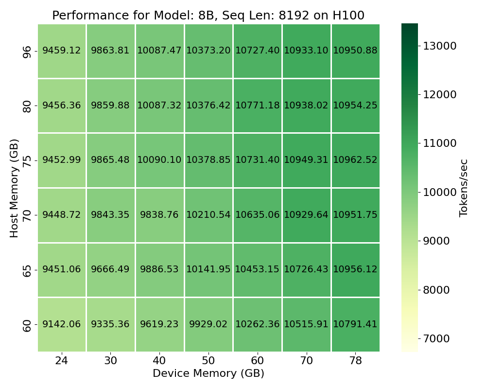
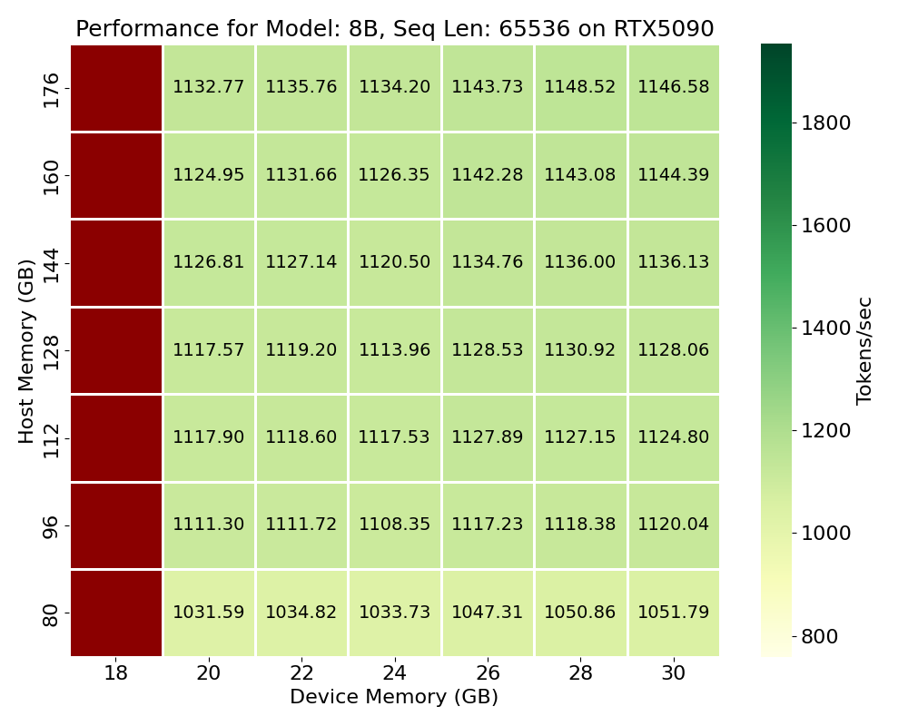

# ML Dataflow: *Efficient* & *Portable* Machine Learning

<sup><em>Currently a work in-progress... </em></sup>

You can learn more about the project's background/details [here](docs/background.md)

-----

## Benefits

#### Train long-sequences or large-models on single device or at home
- Automatically offloads/prefetches (parameters, activations, gradients, & optimizer state) and configures recomputation based on specified memory capacities, seqlen, and model size. Asynchrous dataflow is abundant, but the math remains the same.





#### 6% Higher Training Throughput vs. [Nvidia Baseline](https://catalog.ngc.nvidia.com/orgs/nvidia/teams/dgxc-benchmarking/resources/llama31-8b-dgxc-benchmarking-b)
- Trains Llama3 8B (BF16) with 8k sequence length at ~10,800 vs ~10,120 Tok/s per H100
    - [Profiling](docs/sample_profiling_trace.md)
- Requires only 1 H100 to achieve such performance.
- 55% higher throughput compared to [Mosaic ML benchmark](https://github.com/mosaicml/llm-foundry/blob/main/scripts/train/benchmarking/README.md) training 7B model with 8k seqlen on 8 H100's (6935 Tok/sec)

### [Try It Out Yourself](#training-performance-demo) or [See Full Benchmarking Results](#benchmarked-results)

### Future Work

#### Ideal Schedule for Extending to Distributed Training
- Almost all aspects of single-worker algorithm stay the same, except for cyclic sharding of layers across devices to create a ring. [Link to a simulator](https://dataflowsim.sunshein.net)
- **No collective communication required**<sup>*</sup>! (*except for a.) all-reduce before opt step if num replicas > 1 or b.) if the batch size required to saturate GPUs is too large and inefficient for learning, EP or TP can be utilized). The forms of parallelism employed are PP/DP (intra-replica) and DP (inter-replica)
- Eases resource allocation. A set of GPUs + slices of local host mem can be linked together and maintain high performance => doesn't require high BW GPU-GPU interconnects. This makes job scheduler's life easier and can bolster overall cluster utilization.
#### Opportunity for Concurrent Training and Inference
- Now that we have shuffled training-related data to host memory, this leaves room in precious device memory for running memory-bound inference workloads alongside the compute-bound training. This is particularly relevant for RL training...

-----

## Training Performance Demo

You can demo training performance of canonical causal transformer under different memory environments, sequence lengths, or model sizes. The demo program expects users to specify:
- Host Memory Capacity
- Device Memory Capacity
- Sequence Length
- Model Size (llama3 arch for now, either 1B or 8B)


#### Installation & Usage

##### Current hardware support 
- Nvidia GPUs
    - sm80+ (Ampere/Ada, Hopper, Blackwell)

1. *Download this repo*: 

```shell
git clone git@github.com:als244/ml_dataflow.git
```

2. *Build from source*:

```shell
make -j <NUM_PROCS>
```

###### Note that building the flash2 and flash3 wrapper libraries may take some time (a few hours)...using more processors will help. 

3. *Download model checkpoints (llama3 1B and 8B instruct models in raw binary format)*:

```shell
cd models
./download_llama3_model_binaries.sh
```

4. *Test out training*:

```shell
cd ../bench
./transformerDemo <host_mem_gb> <dev_mem_gb> <seqlen: [num tokens]> <model size billions: [1 | 8]>
```

For example:

`./transformerDemo 80 20 4096 8` will train the 8B model architecture (full bf16, causal attention, next token prediction, AdamW). The sequence length is set to 4096 tokens. The memory capacities are set to enforce <= 80 GB of host memory and <= 20 GB of device memory (where XXX GB is defined as XXX * 2^30 bytes).

**Training Overview & Terminology**:

The training is set up so that there are multiple *rounds* of forward+bwd before an optimizer step (i.e. gradient accumulation). The demo trains for 10 steps. The number of rounds per-step is set to be the minimum (lowest global batch size) that ensures the step overhead will be below a target overhead. This is achieved by setting a target duration for computation during each step (6 seconds for 1B and 48 seconds for 8B => 1-2% overhead). Within a round, there are *ordered chunks*. A minimum chunk size is set to ensure high arithmetic intensity (16k for H100, 8k for others). Each chunk is either packed with multiple sequences (if they are short) or a temporally-contiguous portion of a longer sequence. The number of chunks within a round is determined such that for a given layer, the total bytes of activations saved from the foward pass is approximately the total bytes of the layer weights (or in the case of long-context is the total number of chunks a single sequence requires). Every chunk is proccesed for a layer, before the first chunk starts upon the next layer. During backwards pass, the chunks are processed in reverse order.

The input data is the first 65536 tokens of Harry Potter. If you select a sequence length longer than this than the original sequence will wrap around an repeat until your set seqlen is reached. 

4b. *Profile the training*

```shell
./do_transformer_proifle.sh <host_mem_gb> <dev_mem_gb> <seqlen: [num tokens]> <model size billions: [1 | 8]>
```

This will create a `.nsys-rep` file within `bench/profiling` that be can loaded into the Nvidia Sight Systems GUI. There are NVTX ranges that should have intuitive meanings when inspecting the report (see training terminology above). On the left side of the timeline click "CUDA HW" followed by the stream labeled "Compute". From here you can expand the NVTX to see all of the computations.


-----

## Benchmarked Results

These results were recorded by running

```shell
python bench/reproduce_results/sweep_training_environments.py <sweep config json file> <output csv filename>
```

##### Machine Specs

Tested across 4 different machines:

| GPU Model | Advertised Peak BF16 Compute | PCIe Unidirectional BW | Server Type | Host Memory BW | Host Memory Capacity |
| :--- | :---: | :---: | :---: | :---: | :---: |
| H100 SXM5 | 989 TFLOPS/s | 64 GB/s | Intel Sapphire Rapids (Xeon Platinum 8468) | 307.2 GB/s<sup>*</sup> | 192 GB |
| A100 80GB | 312.5 TFLOPS/s | 32 GB/s | Intel Ice Lake (Xeon Gold 6432) | 93.8 GB/s<sup>*</sup> | 192 GB |
| RTX 5090 | 209.5 TFLOPS/s | 64 GB/s | Gaming PC (Intel z790, i9 13000KF) | 83.2 GB/s | 192 GB |
| RTX 3090 | 71 TFLOPS/s | 32 GB/s | Gaming PC (AMD x570, Ryzen 5950x) | 51.2 GB/s | 128 GB |

*The H100 and A100 are each on 2-node NUMA systems with 8 and 4 memory controllers per NUMA node and with speeds of 4800 MT/s and 2933 MT/s respectively. Host memory BW refers to local numa node.

---

### Performance Reports

Click on a GPU type to expand the table of performance reports for different model sizes and sequence lengths. Each cell contains links to reports for Tokens per second (**Tok/s**), TFLOPs per second (**TFLOPS/s**), Model FLOPs Utilization (**MFU**), and Hardware FLOPs Utilization (**HFU**). Metric definitions are below. 

The reports display a heatmap reporting the metric under different host and device memory capacities. 

The heatmaps are generated by running:

```shell
python bench/reproduce_results/plot_throughput.py <csv filepath to plot> <device_name> <output dir>
```


---

<details>
<summary><strong>NVIDIA H100</strong></summary>

| Sequence Length | 1B Parameter Model | 8B Parameter Model |
|:---|:---|:---|
| **512** | [Tok/s](./bench/reproduce_results/figures/memory_throughput_heatmaps/H100-1B-512-tok.png), [TFLOPS/s](./bench/reproduce_results/figures/memory_throughput_heatmaps/H100-1B-512-tflops.png), [MFU](./bench/reproduce_results/figures/memory_throughput_heatmaps/H100-1B-512-mfu.png), [HFU](./bench/reproduce_results/figures/memory_throughput_heatmaps/H100-1B-512-hfu.png) | [Tok/s](./bench/reproduce_results/figures/memory_throughput_heatmaps/H100-8B-512-tok.png), [TFLOPS/s](./bench/reproduce_results/figures/memory_throughput_heatmaps/H100-8B-512-tflops.png), [MFU](./bench/reproduce_results/figures/memory_throughput_heatmaps/H100-8B-512-mfu.png), [HFU](./bench/reproduce_results/figures/memory_throughput_heatmaps/H100-8B-512-hfu.png) |
| **1,024** | [Tok/s](./bench/reproduce_results/figures/memory_throughput_heatmaps/H100-1B-1024-tok.png), [TFLOPS/s](./bench/reproduce_results/figures/memory_throughput_heatmaps/H100-1B-1024-tflops.png), [MFU](./bench/reproduce_results/figures/memory_throughput_heatmaps/H100-1B-1024-mfu.png), [HFU](./bench/reproduce_results/figures/memory_throughput_heatmaps/H100-1B-1024-hfu.png) | [Tok/s](./bench/reproduce_results/figures/memory_throughput_heatmaps/H100-8B-1024-tok.png), [TFLOPS/s](./bench/reproduce_results/figures/memory_throughput_heatmaps/H100-8B-1024-tflops.png), [MFU](./bench/reproduce_results/figures/memory_throughput_heatmaps/H100-8B-1024-mfu.png), [HFU](./bench/reproduce_results/figures/memory_throughput_heatmaps/H100-8B-1024-hfu.png) |
| **2,048** | [Tok/s](./bench/reproduce_results/figures/memory_throughput_heatmaps/H100-1B-2048-tok.png), [TFLOPS/s](./bench/reproduce_results/figures/memory_throughput_heatmaps/H100-1B-2048-tflops.png), [MFU](./bench/reproduce_results/figures/memory_throughput_heatmaps/H100-1B-2048-mfu.png), [HFU](./bench/reproduce_results/figures/memory_throughput_heatmaps/H100-1B-2048-hfu.png) | [Tok/s](./bench/reproduce_results/figures/memory_throughput_heatmaps/H100-8B-2048-tok.png), [TFLOPS/s](./bench/reproduce_results/figures/memory_throughput_heatmaps/H100-8B-2048-tflops.png), [MFU](./bench/reproduce_results/figures/memory_throughput_heatmaps/H100-8B-2048-mfu.png), [HFU](./bench/reproduce_results/figures/memory_throughput_heatmaps/H100-8B-2048-hfu.png) |
| **4,096** | [Tok/s](./bench/reproduce_results/figures/memory_throughput_heatmaps/H100-1B-4096-tok.png), [TFLOPS/s](./bench/reproduce_results/figures/memory_throughput_heatmaps/H100-1B-4096-tflops.png), [MFU](./bench/reproduce_results/figures/memory_throughput_heatmaps/H100-1B-4096-mfu.png), [HFU](./bench/reproduce_results/figures/memory_throughput_heatmaps/H100-1B-4096-hfu.png) | [Tok/s](./bench/reproduce_results/figures/memory_throughput_heatmaps/H100-8B-4096-tok.png), [TFLOPS/s](./bench/reproduce_results/figures/memory_throughput_heatmaps/H100-8B-4096-tflops.png), [MFU](./bench/reproduce_results/figures/memory_throughput_heatmaps/H100-8B-4096-mfu.png), [HFU](./bench/reproduce_results/figures/memory_throughput_heatmaps/H100-8B-4096-hfu.png) |
| **8,192** | [Tok/s](./bench/reproduce_results/figures/memory_throughput_heatmaps/H100-1B-8192-tok.png), [TFLOPS/s](./bench/reproduce_results/figures/memory_throughput_heatmaps/H100-1B-8192-tflops.png), [MFU](./bench/reproduce_results/figures/memory_throughput_heatmaps/H100-1B-8192-mfu.png), [HFU](./bench/reproduce_results/figures/memory_throughput_heatmaps/H100-1B-8192-hfu.png) | [Tok/s](./bench/reproduce_results/figures/memory_throughput_heatmaps/H100-8B-8192-tok.png), [TFLOPS/s](./bench/reproduce_results/figures/memory_throughput_heatmaps/H100-8B-8192-tflops.png), [MFU](./bench/reproduce_results/figures/memory_throughput_heatmaps/H100-8B-8192-mfu.png), [HFU](./bench/reproduce_results/figures/memory_throughput_heatmaps/H100-8B-8192-hfu.png) |
| **16,384** | [Tok/s](./bench/reproduce_results/figures/memory_throughput_heatmaps/H100-1B-16384-tok.png), [TFLOPS/s](./bench/reproduce_results/figures/memory_throughput_heatmaps/H100-1B-16384-tflops.png), [MFU](./bench/reproduce_results/figures/memory_throughput_heatmaps/H100-1B-16384-mfu.png), [HFU](./bench/reproduce_results/figures/memory_throughput_heatmaps/H100-1B-16384-hfu.png) | [Tok/s](./bench/reproduce_results/figures/memory_throughput_heatmaps/H100-8B-16384-tok.png), [TFLOPS/s](./bench/reproduce_results/figures/memory_throughput_heatmaps/H100-8B-16384-tflops.png), [MFU](./bench/reproduce_results/figures/memory_throughput_heatmaps/H100-8B-16384-mfu.png), [HFU](./bench/reproduce_results/figures/memory_throughput_heatmaps/H100-8B-16384-hfu.png) |
| **32,768** | [Tok/s](./bench/reproduce_results/figures/memory_throughput_heatmaps/H100-1B-32768-tok.png), [TFLOPS/s](./bench/reproduce_results/figures/memory_throughput_heatmaps/H100-1B-32768-tflops.png), [MFU](./bench/reproduce_results/figures/memory_throughput_heatmaps/H100-1B-32768-mfu.png), [HFU](./bench/reproduce_results/figures/memory_throughput_heatmaps/H100-1B-32768-hfu.png) | [Tok/s](./bench/reproduce_results/figures/memory_throughput_heatmaps/H100-8B-32768-tok.png), [TFLOPS/s](./bench/reproduce_results/figures/memory_throughput_heatmaps/H100-8B-32768-tflops.png), [MFU](./bench/reproduce_results/figures/memory_throughput_heatmaps/H100-8B-32768-mfu.png), [HFU](./bench/reproduce_results/figures/memory_throughput_heatmaps/H100-8B-32768-hfu.png) |
| **65,536** | [Tok/s](./bench/reproduce_results/figures/memory_throughput_heatmaps/H100-1B-65536-tok.png), [TFLOPS/s](./bench/reproduce_results/figures/memory_throughput_heatmaps/H100-1B-65536-tflops.png), [MFU](./bench/reproduce_results/figures/memory_throughput_heatmaps/H100-1B-65536-mfu.png), [HFU](./bench/reproduce_results/figures/memory_throughput_heatmaps/H100-1B-65536-hfu.png) | [Tok/s](./bench/reproduce_results/figures/memory_throughput_heatmaps/H100-8B-65536-tok.png), [TFLOPS/s](./bench/reproduce_results/figures/memory_throughput_heatmaps/H100-8B-65536-tflops.png), [MFU](./bench/reproduce_results/figures/memory_throughput_heatmaps/H100-8B-65536-mfu.png), [HFU](./bench/reproduce_results/figures/memory_throughput_heatmaps/H100-8B-65536-hfu.png) |
| **131,072** | [Tok/s](./bench/reproduce_results/figures/memory_throughput_heatmaps/H100-1B-131072-tok.png), [TFLOPS/s](./bench/reproduce_results/figures/memory_throughput_heatmaps/H100-1B-131072-tflops.png), [MFU](./bench/reproduce_results/figures/memory_throughput_heatmaps/H100-1B-131072-mfu.png), [HFU](./bench/reproduce_results/figures/memory_throughput_heatmaps/H100-1B-131072-hfu.png) | [Tok/s](./bench/reproduce_results/figures/memory_throughput_heatmaps/H100-8B-131072-tok.png), [TFLOPS/s](./bench/reproduce_results/figures/memory_throughput_heatmaps/H100-8B-131072-tflops.png), [MFU](./bench/reproduce_results/figures/memory_throughput_heatmaps/H100-8B-131072-mfu.png), [HFU](./bench/reproduce_results/figures/memory_throughput_heatmaps/H100-8B-131072-hfu.png) |
| **262,144** | [Tok/s](./bench/reproduce_results/figures/memory_throughput_heatmaps/H100-1B-262144-tok.png), [TFLOPS/s](./bench/reproduce_results/figures/memory_throughput_heatmaps/H100-1B-262144-tflops.png), [MFU](./bench/reproduce_results/figures/memory_throughput_heatmaps/H100-1B-262144-mfu.png), [HFU](./bench/reproduce_results/figures/memory_throughput_heatmaps/H100-1B-262144-hfu.png) | [Tok/s](./bench/reproduce_results/figures/memory_throughput_heatmaps/H100-8B-262144-tok.png), [TFLOPS/s](./bench/reproduce_results/figures/memory_throughput_heatmaps/H100-8B-262144-tflops.png), [MFU](./bench/reproduce_results/figures/memory_throughput_heatmaps/H100-8B-262144-mfu.png), [HFU](./bench/reproduce_results/figures/memory_throughput_heatmaps/H100-8B-262144-hfu.png) |

</details>

---

<details>
<summary><strong>NVIDIA A100</strong></summary>

| Sequence Length | 1B Parameter Model | 8B Parameter Model |
|:---|:---|:---|
| **512** | [Tok/s](./bench/reproduce_results/figures/memory_throughput_heatmaps/A100-1B-512-tok.png), [TFLOPS/s](./bench/reproduce_results/figures/memory_throughput_heatmaps/A100-1B-512-tflops.png), [MFU](./bench/reproduce_results/figures/memory_throughput_heatmaps/A100-1B-512-mfu.png), [HFU](./bench/reproduce_results/figures/memory_throughput_heatmaps/A100-1B-512-hfu.png) | [Tok/s](./bench/reproduce_results/figures/memory_throughput_heatmaps/A100-8B-512-tok.png), [TFLOPS/s](./bench/reproduce_results/figures/memory_throughput_heatmaps/A100-8B-512-tflops.png), [MFU](./bench/reproduce_results/figures/memory_throughput_heatmaps/A100-8B-512-mfu.png), [HFU](./bench/reproduce_results/figures/memory_throughput_heatmaps/A100-8B-512-hfu.png) |
| **1,024** | [Tok/s](./bench/reproduce_results/figures/memory_throughput_heatmaps/A100-1B-1024-tok.png), [TFLOPS/s](./bench/reproduce_results/figures/memory_throughput_heatmaps/A100-1B-1024-tflops.png), [MFU](./bench/reproduce_results/figures/memory_throughput_heatmaps/A100-1B-1024-mfu.png), [HFU](./bench/reproduce_results/figures/memory_throughput_heatmaps/A100-1B-1024-hfu.png) | [Tok/s](./bench/reproduce_results/figures/memory_throughput_heatmaps/A100-8B-1024-tok.png), [TFLOPS/s](./bench/reproduce_results/figures/memory_throughput_heatmaps/A100-8B-1024-tflops.png), [MFU](./bench/reproduce_results/figures/memory_throughput_heatmaps/A100-8B-1024-mfu.png), [HFU](./bench/reproduce_results/figures/memory_throughput_heatmaps/A100-8B-1024-hfu.png) |
| **2,048** | [Tok/s](./bench/reproduce_results/figures/memory_throughput_heatmaps/A100-1B-2048-tok.png), [TFLOPS/s](./bench/reproduce_results/figures/memory_throughput_heatmaps/A100-1B-2048-tflops.png), [MFU](./bench/reproduce_results/figures/memory_throughput_heatmaps/A100-1B-2048-mfu.png), [HFU](./bench/reproduce_results/figures/memory_throughput_heatmaps/A100-1B-2048-hfu.png) | [Tok/s](./bench/reproduce_results/figures/memory_throughput_heatmaps/A100-8B-2048-tok.png), [TFLOPS/s](./bench/reproduce_results/figures/memory_throughput_heatmaps/A100-8B-2048-tflops.png), [MFU](./bench/reproduce_results/figures/memory_throughput_heatmaps/A100-8B-2048-mfu.png), [HFU](./bench/reproduce_results/figures/memory_throughput_heatmaps/A100-8B-2048-hfu.png) |
| **4,096** | [Tok/s](./bench/reproduce_results/figures/memory_throughput_heatmaps/A100-1B-4096-tok.png), [TFLOPS/s](./bench/reproduce_results/figures/memory_throughput_heatmaps/A100-1B-4096-tflops.png), [MFU](./bench/reproduce_results/figures/memory_throughput_heatmaps/A100-1B-4096-mfu.png), [HFU](./bench/reproduce_results/figures/memory_throughput_heatmaps/A100-1B-4096-hfu.png) | [Tok/s](./bench/reproduce_results/figures/memory_throughput_heatmaps/A100-8B-4096-tok.png), [TFLOPS/s](./bench/reproduce_results/figures/memory_throughput_heatmaps/A100-8B-4096-tflops.png), [MFU](./bench/reproduce_results/figures/memory_throughput_heatmaps/A100-8B-4096-mfu.png), [HFU](./bench/reproduce_results/figures/memory_throughput_heatmaps/A100-8B-4096-hfu.png) |
| **8,192** | [Tok/s](./bench/reproduce_results/figures/memory_throughput_heatmaps/A100-1B-8192-tok.png), [TFLOPS/s](./bench/reproduce_results/figures/memory_throughput_heatmaps/A100-1B-8192-tflops.png), [MFU](./bench/reproduce_results/figures/memory_throughput_heatmaps/A100-1B-8192-mfu.png), [HFU](./bench/reproduce_results/figures/memory_throughput_heatmaps/A100-1B-8192-hfu.png) | [Tok/s](./bench/reproduce_results/figures/memory_throughput_heatmaps/A100-8B-8192-tok.png), [TFLOPS/s](./bench/reproduce_results/figures/memory_throughput_heatmaps/A100-8B-8192-tflops.png), [MFU](./bench/reproduce_results/figures/memory_throughput_heatmaps/A100-8B-8192-mfu.png), [HFU](./bench/reproduce_results/figures/memory_throughput_heatmaps/A100-8B-8192-hfu.png) |
| **16,384** | [Tok/s](./bench/reproduce_results/figures/memory_throughput_heatmaps/A100-1B-16384-tok.png), [TFLOPS/s](./bench/reproduce_results/figures/memory_throughput_heatmaps/A100-1B-16384-tflops.png), [MFU](./bench/reproduce_results/figures/memory_throughput_heatmaps/A100-1B-16384-mfu.png), [HFU](./bench/reproduce_results/figures/memory_throughput_heatmaps/A100-1B-16384-hfu.png) | [Tok/s](./bench/reproduce_results/figures/memory_throughput_heatmaps/A100-8B-16384-tok.png), [TFLOPS/s](./bench/reproduce_results/figures/memory_throughput_heatmaps/A100-8B-16384-tflops.png), [MFU](./bench/reproduce_results/figures/memory_throughput_heatmaps/A100-8B-16384-mfu.png), [HFU](./bench/reproduce_results/figures/memory_throughput_heatmaps/A100-8B-16384-hfu.png) |
| **32,768** | [Tok/s](./bench/reproduce_results/figures/memory_throughput_heatmaps/A100-1B-32768-tok.png), [TFLOPS/s](./bench/reproduce_results/figures/memory_throughput_heatmaps/A100-1B-32768-tflops.png), [MFU](./bench/reproduce_results/figures/memory_throughput_heatmaps/A100-1B-32768-mfu.png), [HFU](./bench/reproduce_results/figures/memory_throughput_heatmaps/A100-1B-32768-hfu.png) | [Tok/s](./bench/reproduce_results/figures/memory_throughput_heatmaps/A100-8B-32768-tok.png), [TFLOPS/s](./bench/reproduce_results/figures/memory_throughput_heatmaps/A100-8B-32768-tflops.png), [MFU](./bench/reproduce_results/figures/memory_throughput_heatmaps/A100-8B-32768-mfu.png), [HFU](./bench/reproduce_results/figures/memory_throughput_heatmaps/A100-8B-32768-hfu.png) |
| **65,536** | [Tok/s](./bench/reproduce_results/figures/memory_throughput_heatmaps/A100-1B-65536-tok.png), [TFLOPS/s](./bench/reproduce_results/figures/memory_throughput_heatmaps/A100-1B-65536-tflops.png), [MFU](./bench/reproduce_results/figures/memory_throughput_heatmaps/A100-1B-65536-mfu.png), [HFU](./bench/reproduce_results/figures/memory_throughput_heatmaps/A100-1B-65536-hfu.png) | [Tok/s](./bench/reproduce_results/figures/memory_throughput_heatmaps/A100-8B-65536-tok.png), [TFLOPS/s](./bench/reproduce_results/figures/memory_throughput_heatmaps/A100-8B-65536-tflops.png), [MFU](./bench/reproduce_results/figures/memory_throughput_heatmaps/A100-8B-65536-mfu.png), [HFU](./bench/reproduce_results/figures/memory_throughput_heatmaps/A100-8B-65536-hfu.png) |
| **131,072** | [Tok/s](./bench/reproduce_results/figures/memory_throughput_heatmaps/A100-1B-131072-tok.png), [TFLOPS/s](./bench/reproduce_results/figures/memory_throughput_heatmaps/A100-1B-131072-tflops.png), [MFU](./bench/reproduce_results/figures/memory_throughput_heatmaps/A100-1B-131072-mfu.png), [HFU](./bench/reproduce_results/figures/memory_throughput_heatmaps/A100-1B-131072-hfu.png) | [Tok/s](./bench/reproduce_results/figures/memory_throughput_heatmaps/A100-8B-131072-tok.png), [TFLOPS/s](./bench/reproduce_results/figures/memory_throughput_heatmaps/A100-8B-131072-tflops.png), [MFU](./bench/reproduce_results/figures/memory_throughput_heatmaps/A100-8B-131072-mfu.png), [HFU](./bench/reproduce_results/figures/memory_throughput_heatmaps/A100-8B-131072-hfu.png) |
| **262,144** | [Tok/s](./bench/reproduce_results/figures/memory_throughput_heatmaps/A100-1B-262144-tok.png), [TFLOPS/s](./bench/reproduce_results/figures/memory_throughput_heatmaps/A100-1B-262144-tflops.png), [MFU](./bench/reproduce_results/figures/memory_throughput_heatmaps/A100-1B-262144-mfu.png), [HFU](./bench/reproduce_results/figures/memory_throughput_heatmaps/A100-1B-262144-hfu.png) | [Tok/s](./bench/reproduce_results/figures/memory_throughput_heatmaps/A100-8B-262144-tok.png), [TFLOPS/s](./bench/reproduce_results/figures/memory_throughput_heatmaps/A100-8B-262144-tflops.png), [MFU](./bench/reproduce_results/figures/memory_throughput_heatmaps/A100-8B-262144-mfu.png), [HFU](./bench/reproduce_results/figures/memory_throughput_heatmaps/A100-8B-262144-hfu.png) |

</details>

---

<details>
<summary><strong>NVIDIA RTX 5090</strong></summary>

| Sequence Length | 1B Parameter Model | 8B Parameter Model |
|:---|:---|:---|
| **512** | [Tok/s](./bench/reproduce_results/figures/memory_throughput_heatmaps/RTX5090-1B-512-tok.png), [TFLOPS/s](./bench/reproduce_results/figures/memory_throughput_heatmaps/RTX5090-1B-512-tflops.png), [MFU](./bench/reproduce_results/figures/memory_throughput_heatmaps/RTX5090-1B-512-mfu.png), [HFU](./bench/reproduce_results/figures/memory_throughput_heatmaps/RTX5090-1B-512-hfu.png) | [Tok/s](./bench/reproduce_results/figures/memory_throughput_heatmaps/RTX5090-8B-512-tok.png), [TFLOPS/s](./bench/reproduce_results/figures/memory_throughput_heatmaps/RTX5090-8B-512-tflops.png), [MFU](./bench/reproduce_results/figures/memory_throughput_heatmaps/RTX5090-8B-512-mfu.png), [HFU](./bench/reproduce_results/figures/memory_throughput_heatmaps/RTX5090-8B-512-hfu.png) |
| **1,024** | [Tok/s](./bench/reproduce_results/figures/memory_throughput_heatmaps/RTX5090-1B-1024-tok.png), [TFLOPS/s](./bench/reproduce_results/figures/memory_throughput_heatmaps/RTX5090-1B-1024-tflops.png), [MFU](./bench/reproduce_results/figures/memory_throughput_heatmaps/RTX5090-1B-1024-mfu.png), [HFU](./bench/reproduce_results/figures/memory_throughput_heatmaps/RTX5090-1B-1024-hfu.png) | [Tok/s](./bench/reproduce_results/figures/memory_throughput_heatmaps/RTX5090-8B-1024-tok.png), [TFLOPS/s](./bench/reproduce_results/figures/memory_throughput_heatmaps/RTX5090-8B-1024-tflops.png), [MFU](./bench/reproduce_results/figures/memory_throughput_heatmaps/RTX5090-8B-1024-mfu.png), [HFU](./bench/reproduce_results/figures/memory_throughput_heatmaps/RTX5090-8B-1024-hfu.png) |
| **2,048** | [Tok/s](./bench/reproduce_results/figures/memory_throughput_heatmaps/RTX5090-1B-2048-tok.png), [TFLOPS/s](./bench/reproduce_results/figures/memory_throughput_heatmaps/RTX5090-1B-2048-tflops.png), [MFU](./bench/reproduce_results/figures/memory_throughput_heatmaps/RTX5090-1B-2048-mfu.png), [HFU](./bench/reproduce_results/figures/memory_throughput_heatmaps/RTX5090-1B-2048-hfu.png) | [Tok/s](./bench/reproduce_results/figures/memory_throughput_heatmaps/RTX5090-8B-2048-tok.png), [TFLOPS/s](./bench/reproduce_results/figures/memory_throughput_heatmaps/RTX5090-8B-2048-tflops.png), [MFU](./bench/reproduce_results/figures/memory_throughput_heatmaps/RTX5090-8B-2048-mfu.png), [HFU](./bench/reproduce_results/figures/memory_throughput_heatmaps/RTX5090-8B-2048-hfu.png) |
| **4,096** | [Tok/s](./bench/reproduce_results/figures/memory_throughput_heatmaps/RTX5090-1B-4096-tok.png), [TFLOPS/s](./bench/reproduce_results/figures/memory_throughput_heatmaps/RTX5090-1B-4096-tflops.png), [MFU](./bench/reproduce_results/figures/memory_throughput_heatmaps/RTX5090-1B-4096-mfu.png), [HFU](./bench/reproduce_results/figures/memory_throughput_heatmaps/RTX5090-1B-4096-hfu.png) | [Tok/s](./bench/reproduce_results/figures/memory_throughput_heatmaps/RTX5090-8B-4096-tok.png), [TFLOPS/s](./bench/reproduce_results/figures/memory_throughput_heatmaps/RTX5090-8B-4096-tflops.png), [MFU](./bench/reproduce_results/figures/memory_throughput_heatmaps/RTX5090-8B-4096-mfu.png), [HFU](./bench/reproduce_results/figures/memory_throughput_heatmaps/RTX5090-8B-4096-hfu.png) |
| **8,192** | [Tok/s](./bench/reproduce_results/figures/memory_throughput_heatmaps/RTX5090-1B-8192-tok.png), [TFLOPS/s](./bench/reproduce_results/figures/memory_throughput_heatmaps/RTX5090-1B-8192-tflops.png), [MFU](./bench/reproduce_results/figures/memory_throughput_heatmaps/RTX5090-1B-8192-mfu.png), [HFU](./bench/reproduce_results/figures/memory_throughput_heatmaps/RTX5090-1B-8192-hfu.png) | [Tok/s](./bench/reproduce_results/figures/memory_throughput_heatmaps/RTX5090-8B-8192-tok.png), [TFLOPS/s](./bench/reproduce_results/figures/memory_throughput_heatmaps/RTX5090-8B-8192-tflops.png), [MFU](./bench/reproduce_results/figures/memory_throughput_heatmaps/RTX5090-8B-8192-mfu.png), [HFU](./bench/reproduce_results/figures/memory_throughput_heatmaps/RTX5090-8B-8192-hfu.png) |
| **16,384** | [Tok/s](./bench/reproduce_results/figures/memory_throughput_heatmaps/RTX5090-1B-16384-tok.png), [TFLOPS/s](./bench/reproduce_results/figures/memory_throughput_heatmaps/RTX5090-1B-16384-tflops.png), [MFU](./bench/reproduce_results/figures/memory_throughput_heatmaps/RTX5090-1B-16384-mfu.png), [HFU](./bench/reproduce_results/figures/memory_throughput_heatmaps/RTX5090-1B-16384-hfu.png) | [Tok/s](./bench/reproduce_results/figures/memory_throughput_heatmaps/RTX5090-8B-16384-tok.png), [TFLOPS/s](./bench/reproduce_results/figures/memory_throughput_heatmaps/RTX5090-8B-16384-tflops.png), [MFU](./bench/reproduce_results/figures/memory_throughput_heatmaps/RTX5090-8B-16384-mfu.png), [HFU](./bench/reproduce_results/figures/memory_throughput_heatmaps/RTX5090-8B-16384-hfu.png) |
| **32,768** | [Tok/s](./bench/reproduce_results/figures/memory_throughput_heatmaps/RTX5090-1B-32768-tok.png), [TFLOPS/s](./bench/reproduce_results/figures/memory_throughput_heatmaps/RTX5090-1B-32768-tflops.png), [MFU](./bench/reproduce_results/figures/memory_throughput_heatmaps/RTX5090-1B-32768-mfu.png), [HFU](./bench/reproduce_results/figures/memory_throughput_heatmaps/RTX5090-1B-32768-hfu.png) | [Tok/s](./bench/reproduce_results/figures/memory_throughput_heatmaps/RTX5090-8B-32768-tok.png), [TFLOPS/s](./bench/reproduce_results/figures/memory_throughput_heatmaps/RTX5090-8B-32768-tflops.png), [MFU](./bench/reproduce_results/figures/memory_throughput_heatmaps/RTX5090-8B-32768-mfu.png), [HFU](./bench/reproduce_results/figures/memory_throughput_heatmaps/RTX5090-8B-32768-hfu.png) |
| **65,536** | [Tok/s](./bench/reproduce_results/figures/memory_throughput_heatmaps/RTX5090-1B-65536-tok.png), [TFLOPS/s](./bench/reproduce_results/figures/memory_throughput_heatmaps/RTX5090-1B-65536-tflops.png), [MFU](./bench/reproduce_results/figures/memory_throughput_heatmaps/RTX5090-1B-65536-mfu.png), [HFU](./bench/reproduce_results/figures/memory_throughput_heatmaps/RTX5090-1B-65536-hfu.png) | [Tok/s](./bench/reproduce_results/figures/memory_throughput_heatmaps/RTX5090-8B-65536-tok.png), [TFLOPS/s](./bench/reproduce_results/figures/memory_throughput_heatmaps/RTX5090-8B-65536-tflops.png), [MFU](./bench/reproduce_results/figures/memory_throughput_heatmaps/RTX5090-8B-65536-mfu.png), [HFU](./bench/reproduce_results/figures/memory_throughput_heatmaps/RTX5090-8B-65536-hfu.png) |
| **131,072** | [Tok/s](./bench/reproduce_results/figures/memory_throughput_heatmaps/RTX5090-1B-131072-tok.png), [TFLOPS/s](./bench/reproduce_results/figures/memory_throughput_heatmaps/RTX5090-1B-131072-tflops.png), [MFU](./bench/reproduce_results/figures/memory_throughput_heatmaps/RTX5090-1B-131072-mfu.png), [HFU](./bench/reproduce_results/figures/memory_throughput_heatmaps/RTX5090-1B-131072-hfu.png) | [Tok/s](./bench/reproduce_results/figures/memory_throughput_heatmaps/RTX5090-8B-131072-tok.png), [TFLOPS/s](./bench/reproduce_results/figures/memory_throughput_heatmaps/RTX5090-8B-131072-tflops.png), [MFU](./bench/reproduce_results/figures/memory_throughput_heatmaps/RTX5090-8B-131072-mfu.png), [HFU](./bench/reproduce_results/figures/memory_throughput_heatmaps/RTX5090-8B-131072-hfu.png) |
| **262,144** | [Tok/s](./bench/reproduce_results/figures/memory_throughput_heatmaps/RTX5090-1B-262144-tok.png), [TFLOPS/s](./bench/reproduce_results/figures/memory_throughput_heatmaps/RTX5090-1B-262144-tflops.png), [MFU](./bench/reproduce_results/figures/memory_throughput_heatmaps/RTX5090-1B-262144-mfu.png), [HFU](./bench/reproduce_results/figures/memory_throughput_heatmaps/RTX5090-1B-262144-hfu.png) | [Tok/s](./bench/reproduce_results/figures/memory_throughput_heatmaps/RTX5090-8B-262144-tok.png), [TFLOPS/s](./bench/reproduce_results/figures/memory_throughput_heatmaps/RTX5090-8B-262144-tflops.png), [MFU](./bench/reproduce_results/figures/memory_throughput_heatmaps/RTX5090-8B-262144-mfu.png), [HFU](./bench/reproduce_results/figures/memory_throughput_heatmaps/RTX5090-8B-262144-hfu.png) |

</details>

---

<details>
<summary><strong>NVIDIA RTX 3090</strong></summary>

| Sequence Length | 1B Parameter Model | 8B Parameter Model |
|:---|:---|:---|
| **512** | [Tok/s](./bench/reproduce_results/figures/memory_throughput_heatmaps/RTX3090-1B-512-tok.png), [TFLOPS/s](./bench/reproduce_results/figures/memory_throughput_heatmaps/RTX3090-1B-512-tflops.png), [MFU](./bench/reproduce_results/figures/memory_throughput_heatmaps/RTX3090-1B-512-mfu.png), [HFU](./bench/reproduce_results/figures/memory_throughput_heatmaps/RTX3090-1B-512-hfu.png) | [Tok/s](./bench/reproduce_results/figures/memory_throughput_heatmaps/RTX3090-8B-512-tok.png), [TFLOPS/s](./bench/reproduce_results/figures/memory_throughput_heatmaps/RTX3090-8B-512-tflops.png), [MFU](./bench/reproduce_results/figures/memory_throughput_heatmaps/RTX3090-8B-512-mfu.png), [HFU](./bench/reproduce_results/figures/memory_throughput_heatmaps/RTX3090-8B-512-hfu.png) |
| **1,024** | [Tok/s](./bench/reproduce_results/figures/memory_throughput_heatmaps/RTX3090-1B-1024-tok.png), [TFLOPS/s](./bench/reproduce_results/figures/memory_throughput_heatmaps/RTX3090-1B-1024-tflops.png), [MFU](./bench/reproduce_results/figures/memory_throughput_heatmaps/RTX3090-1B-1024-mfu.png), [HFU](./bench/reproduce_results/figures/memory_throughput_heatmaps/RTX3090-1B-1024-hfu.png) | [Tok/s](./bench/reproduce_results/figures/memory_throughput_heatmaps/RTX3090-8B-1024-tok.png), [TFLOPS/s](./bench/reproduce_results/figures/memory_throughput_heatmaps/RTX3090-8B-1024-tflops.png), [MFU](./bench/reproduce_results/figures/memory_throughput_heatmaps/RTX3090-8B-1024-mfu.png), [HFU](./bench/reproduce_results/figures/memory_throughput_heatmaps/RTX3090-8B-1024-hfu.png) |
| **2,048** | [Tok/s](./bench/reproduce_results/figures/memory_throughput_heatmaps/RTX3090-1B-2048-tok.png), [TFLOPS/s](./bench/reproduce_results/figures/memory_throughput_heatmaps/RTX3090-1B-2048-tflops.png), [MFU](./bench/reproduce_results/figures/memory_throughput_heatmaps/RTX3090-1B-2048-mfu.png), [HFU](./bench/reproduce_results/figures/memory_throughput_heatmaps/RTX3090-1B-2048-hfu.png) | [Tok/s](./bench/reproduce_results/figures/memory_throughput_heatmaps/RTX3090-8B-2048-tok.png), [TFLOPS/s](./bench/reproduce_results/figures/memory_throughput_heatmaps/RTX3090-8B-2048-tflops.png), [MFU](./bench/reproduce_results/figures/memory_throughput_heatmaps/RTX3090-8B-2048-mfu.png), [HFU](./bench/reproduce_results/figures/memory_throughput_heatmaps/RTX3090-8B-2048-hfu.png) |
| **4,096** | [Tok/s](./bench/reproduce_results/figures/memory_throughput_heatmaps/RTX3090-1B-4096-tok.png), [TFLOPS/s](./bench/reproduce_results/figures/memory_throughput_heatmaps/RTX3090-1B-4096-tflops.png), [MFU](./bench/reproduce_results/figures/memory_throughput_heatmaps/RTX3090-1B-4096-mfu.png), [HFU](./bench/reproduce_results/figures/memory_throughput_heatmaps/RTX3090-1B-4096-hfu.png) | [Tok/s](./bench/reproduce_results/figures/memory_throughput_heatmaps/RTX3090-8B-4096-tok.png), [TFLOPS/s](./bench/reproduce_results/figures/memory_throughput_heatmaps/RTX3090-8B-4096-tflops.png), [MFU](./bench/reproduce_results/figures/memory_throughput_heatmaps/RTX3090-8B-4096-mfu.png), [HFU](./bench/reproduce_results/figures/memory_throughput_heatmaps/RTX3090-8B-4096-hfu.png) |
| **8,192** | [Tok/s](./bench/reproduce_results/figures/memory_throughput_heatmaps/RTX3090-1B-8192-tok.png), [TFLOPS/s](./bench/reproduce_results/figures/memory_throughput_heatmaps/RTX3090-1B-8192-tflops.png), [MFU](./bench/reproduce_results/figures/memory_throughput_heatmaps/RTX3090-1B-8192-mfu.png), [HFU](./bench/reproduce_results/figures/memory_throughput_heatmaps/RTX3090-1B-8192-hfu.png) | [Tok/s](./bench/reproduce_results/figures/memory_throughput_heatmaps/RTX3090-8B-8192-tok.png), [TFLOPS/s](./bench/reproduce_results/figures/memory_throughput_heatmaps/RTX3090-8B-8192-tflops.png), [MFU](./bench/reproduce_results/figures/memory_throughput_heatmaps/RTX3090-8B-8192-mfu.png), [HFU](./bench/reproduce_results/figures/memory_throughput_heatmaps/RTX3090-8B-8192-hfu.png) |
| **16,384** | [Tok/s](./bench/reproduce_results/figures/memory_throughput_heatmaps/RTX3090-1B-16384-tok.png), [TFLOPS/s](./bench/reproduce_results/figures/memory_throughput_heatmaps/RTX3090-1B-16384-tflops.png), [MFU](./bench/reproduce_results/figures/memory_throughput_heatmaps/RTX3090-1B-16384-mfu.png), [HFU](./bench/reproduce_results/figures/memory_throughput_heatmaps/RTX3090-1B-16384-hfu.png) | [Tok/s](./bench/reproduce_results/figures/memory_throughput_heatmaps/RTX3090-8B-16384-tok.png), [TFLOPS/s](./bench/reproduce_results/figures/memory_throughput_heatmaps/RTX3090-8B-16384-tflops.png), [MFU](./bench/reproduce_results/figures/memory_throughput_heatmaps/RTX3090-8B-16384-mfu.png), [HFU](./bench/reproduce_results/figures/memory_throughput_heatmaps/RTX3090-8B-16384-hfu.png) |
| **32,768** | [Tok/s](./bench/reproduce_results/figures/memory_throughput_heatmaps/RTX3090-1B-32768-tok.png), [TFLOPS/s](./bench/reproduce_results/figures/memory_throughput_heatmaps/RTX3090-1B-32768-tflops.png), [MFU](./bench/reproduce_results/figures/memory_throughput_heatmaps/RTX3090-1B-32768-mfu.png), [HFU](./bench/reproduce_results/figures/memory_throughput_heatmaps/RTX3090-1B-32768-hfu.png) | [Tok/s](./bench/reproduce_results/figures/memory_throughput_heatmaps/RTX3090-8B-32768-tok.png), [TFLOPS/s](./bench/reproduce_results/figures/memory_throughput_heatmaps/RTX3090-8B-32768-tflops.png), [MFU](./bench/reproduce_results/figures/memory_throughput_heatmaps/RTX3090-8B-32768-mfu.png), [HFU](./bench/reproduce_results/figures/memory_throughput_heatmaps/RTX3090-8B-32768-hfu.png) |
| **65,536** | [Tok/s](./bench/reproduce_results/figures/memory_throughput_heatmaps/RTX3090-1B-65536-tok.png), [TFLOPS/s](./bench/reproduce_results/figures/memory_throughput_heatmaps/RTX3090-1B-65536-tflops.png), [MFU](./bench/reproduce_results/figures/memory_throughput_heatmaps/RTX3090-1B-65536-mfu.png), [HFU](./bench/reproduce_results/figures/memory_throughput_heatmaps/RTX3090-1B-65536-hfu.png) | [Tok/s](./bench/reproduce_results/figures/memory_throughput_heatmaps/RTX3090-8B-65536-tok.png), [TFLOPS/s](./bench/reproduce_results/figures/memory_throughput_heatmaps/RTX3090-8B-65536-tflops.png), [MFU](./bench/reproduce_results/figures/memory_throughput_heatmaps/RTX3090-8B-65536-mfu.png), [HFU](./bench/reproduce_results/figures/memory_throughput_heatmaps/RTX3090-8B-65536-hfu.png) |
| **131,072** | [Tok/s](./bench/reproduce_results/figures/memory_throughput_heatmaps/RTX3090-1B-131072-tok.png), [TFLOPS/s](./bench/reproduce_results/figures/memory_throughput_heatmaps/RTX3090-1B-131072-tflops.png), [MFU](./bench/reproduce_results/figures/memory_throughput_heatmaps/RTX3090-1B-131072-mfu.png), [HFU](./bench/reproduce_results/figures/memory_throughput_heatmaps/RTX3090-1B-131072-hfu.png) | [Tok/s](./bench/reproduce_results/figures/memory_throughput_heatmaps/RTX3090-8B-131072-tok.png), [TFLOPS/s](./bench/reproduce_results/figures/memory_throughput_heatmaps/RTX3090-8B-131072-tflops.png), [MFU](./bench/reproduce_results/figures/memory_throughput_heatmaps/RTX3090-8B-131072-mfu.png), [HFU](./bench/reproduce_results/figures/memory_throughput_heatmaps/RTX3090-8B-131072-hfu.png) |
| **262,144** | [Tok/s](./bench/reproduce_results/figures/memory_throughput_heatmaps/RTX3090-1B-262144-tok.png), [TFLOPS/s](./bench/reproduce_results/figures/memory_throughput_heatmaps/RTX3090-1B-262144-tflops.png), [MFU](./bench/reproduce_results/figures/memory_throughput_heatmaps/RTX3090-1B-262144-mfu.png), [HFU](./bench/reproduce_results/figures/memory_throughput_heatmaps/RTX3090-1B-262144-hfu.png) | [Tok/s](./bench/reproduce_results/figures/memory_throughput_heatmaps/RTX3090-8B-262144-tok.png), [TFLOPS/s](./bench/reproduce_results/figures/memory_throughput_heatmaps/RTX3090-8B-262144-tflops.png), [MFU](./bench/reproduce_results/figures/memory_throughput_heatmaps/RTX3090-8B-262144-mfu.png), [HFU](./bench/reproduce_results/figures/memory_throughput_heatmaps/RTX3090-8B-262144-hfu.png) |

</details>

<sup> Note: It ought to be the case that increasing one memory axis while keeping the other fixed should only equal or improve throughput. However, the recomputation decisions are currently "greedy" in the sense that it will avoid as much recomputation as possible. This works for the common case, but there are some scenarios (fast device + small device memory + short seq len) where the links to/from host memory become congested at bad times leading to stalls -- in this case recompuation provides higher throughput. See the H100, 8B, seqlen 512 heatmap or profile yourself. The configuration decisions are being tuned to ensure more memory => higher throughput. </sup>

---

### Throughput Metrics

The details of these calculations can be found within `backends/host/src/ops/metrics/throughput.c`.

Let:
$S$ = seqlen, $N$ = seqs per step, $T$ = step runtime, $D$ = model dim, $K$ = kv dim, $F$ = feed forward dimension, $V$ = vocab size, $L$= number of layers

- Tokens/sec: Unambigous -- the training throughput. For a fixed model architecture and seqlen this is the cleanest metric to compare against:
```math
\text{Tokens per second} = (N * S) / T
```

- TFLOPS/s: Effective throughput of processing (model flops / runtime). There is ambiguity among different frameworks about the proper "cost" of the model, so this number is hard to compare apples-to-apples if formulas are not given. It is common for many codebases to "over-report" TFLOPS/sec for causal models (not accounting for the fact that only half of the attention scores need to be calculated). The model cost should be implementation agnostic. The TFLOP numbers in the performance reports above are derived from the formula blelow (llama3 model architecture, causal attention):
```math
\begin{aligned}
\text{layer matmul flops} &= 2 * S * D * (2 * D + 2 * K + 3 * F) \\
\text{attn fwd flops} &= .5 * 2 * (2 * S * S * D) \\
\text{attn bwd flops} &= .5 * 4 * (2 * S * S * D) \\
\text{head flops} &= 3 * (2 * S * D * V) \\
\text{per seq flops} &= L * (3 * \text{layer matmul flops} + \text{attn fwd flops} + \text{attn bwd flops}) + \text{head flops} \\
\text{model step cost} &= N * \text{per seq flops} \\
&= N * (L * (6 * S * D * (2 * D + 2 * K + 3 * F) + 6 * S * S * D) + 6 * S * D * V) \\ 
\text{TFLOPS/sec} &= \text{model step cost} / T
\end{aligned}
```
Where the $(2 * D + 2 * K + 3 * F)$ factor is coming from Q, O, K+V and the 3 FFN matrices within each block. The $.5$ factor in attn flops comes from causal variant. There are 2 matmuls in attn fwd and 4 in attn bwd. The per seq flops comes from Fwd + Bwd X + Bwd W. They all share the same matmuls, but Fwd has attn fwd and Bwd X has attn bwd. Bwd W just contains the base matmuls. The head does fwd, bwd x, and bwd w matmuls. Embedding is essentially free as it is simple memcopies (forward) or additions (backward).

- MFU (Model Flops Utilization): A measure of effective throughput relative to hardware capabilities (where TFLOPS is calculated above)
```math
\text{MFU} = \text{TFLOPS} / \text{peak hardware TFLOPS}
```

- HFU (Hardware Flops Utilization): A measure of processing throughput (including recomputations in numerator) relative to hardware capabilities. There are 2 levels are recomputation that occur depending on memory capacities -- the system automatically configures this and calculates the accurate metric. See the `throughput.c` file for more details. [Flash Attention](https://github.com/Dao-AILab/flash-attention) is employed which recomputes the attention score matrix (implicity) during the backwards pass, so by default at least $N * L * (.5 * 2 * (S * S * D))$ FLOPs are recomputed per step. Here we see that $\text{HFU}$ is strictly greater than $\text{MFU}$.

-----

**Practical note**: The training demo source code is quite messy! This is not the intended usage, there are some missing pieces... Critical upstream functionality (*data ingestion*, *model/loss/optimizer customization*, *model saving/loading*, *multi-worker training*, & *a wider set of common kernels such as attention variants, other normalizations, optimizers, convolutions, and MoE selecting/routing/combining*) is underway. You can try out a [simulator](https://dataflowsim.sunshein.net) for what this repo aims to accomplish in its final multi-worker form.

The plan is to build a robust core of C libraries and create user-friendly Python bindings (at the various layers of stack) for convenient interfacing. Typical usage will have a similar API to most other training frameworks and only need to use the top-level bindings. 

A true interface will be released when the basic dataloading functionality is ready. 

The intial emphasis is for training; after this is working properly, focus will shift to inference. 

-----

## API


***Not ready yet...***

