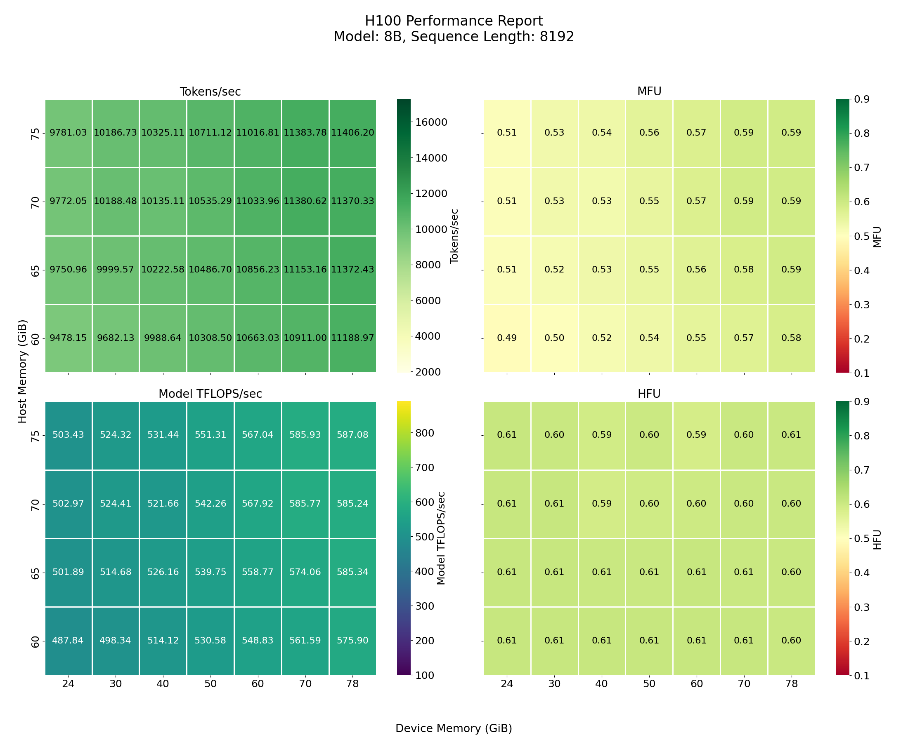

# ML Dataflow: *Efficient* & *Portable* Machine Learning

<sup><em>Currently a work in-progress... </em></sup>

You can learn more about the project's background/details [here](docs/background.md)

-----

## Highlights

### State of the Art Transformer Training

#### 7% Higher Training Throughput vs. [Optimized Nvidia Baseline](https://catalog.ngc.nvidia.com/orgs/nvidia/teams/dgxc-benchmarking/resources/nemo-llama31-dgxc-benchmarking-g)
- Trains Llama3 8B (BF16) with 8k sequence length at ~11,400 vs ~10,680 Tok/s per H100
    - Requires only 1 H100 to achieve such performance and even performs near peak with as little as 24GiB of HBM
        - vs. 8xH100 = 640GB (!!!) of HBM used for Nvidia baseline.


###### [Metric Definitions](#throughput-metrics)



###### Comparisons to other repos at longer sequence lengths

- **182% higher throughput** training 8B with 64k seqlen compared to a prior [Mosaic ML benchmark](https://github.com/mosaicml/llm-foundry/blob/main/scripts/train/benchmarking/README.md) training a smaller 7B MPT model across 8 H100's ([5500 Tok/sec](bench/reproduce_results/figures/memory_throughput_heatmaps/H100/H100-8B-65536-report.png) vs. 1950 Tok/sec per GPU)
- **90% higher throughput** training 8B with 512k seqlen on single H100 vs. [Snowflake benchmark](https://www.arxiv.org/pdf/2506.13996) ([950 Tok/sec](bench/reproduce_results/figures/memory_throughput_heatmaps/H100/H100-8B-524288-report.png) vs. 500 Tok/sec per GPU at 256 GiB of host)

### Train Long Sequences or Large Models on Single Device or At Home
- Automatically offloads/prefetches (parameters, activations, gradients, & optimizer state) and configures recomputation based on specified memory capacities, seqlen, and model size. Asynchronous dataflow is abundant, but the math remains the same.

##### [Try It Out Yourself](#training-performance-demo) or [See Full Benchmarking Results](#benchmarked-results)

#### Training Notes: 

> All training is done using a single GPU as computational workhorse. 

> Training for benchmarks is conducted in full bfloat16 with AdamW optimizer. Thus, the total aggregate memory footprint for the model's training state (i.e. Parameters + Gradients + Optimizer State) = 8 * \# Model Parameters bytes. (SSD is not utilized to preserve longevity).

###### Training at Home (RTX 5090): 15B Model with 16k Sequence Length 


###### Near-Peak Throughput Despite Massive Oversubscription (H100): 32B Model with 64k Sequence Length 


-----

## Training Performance Demo

You can demo training performance of canonical causal transformer (i.e. Transformer++) under different memory environments, sequence lengths, or model sizes. The demo program expects users to specify:
- Host Memory Capacity
- Device Memory Capacity
- Sequence Length
- Model


#### Installation & Usage

##### System Requirements (for now)
- OS: 
    - Linux
- Compiler:
    - gcc13+
- Backends:
    - Nvidia GPUs
        - sm80+ (Ampere/Ada, Hopper, Blackwell)

1. *Download this repo*: 

```shell
git clone git@github.com:als244/ml_dataflow.git
```

2. *Build from source*:

```shell
make -j <NUM_PROCS>
```

The project is built from < 10k lines of C, a few logically unique memory-bound GPU kernels, and wrappers over [Flash Attention](https://github.com/Dao-AILab/flash-attention) and vendor BLAS libraries (performance critical computation kernels). The only dependencies are the backend userspace driver, backend BLAS lib, & OpenSSL (typically pre-installed). For Nvidia backend it assumes that headers and libs are in standard location `/usr/local/cuda`. 

###### Note that building the flash2 and flash3 wrapper libraries may take some time (a few hours)...using more processors will help. 

3. *Initialize Model*:

```shell
cd models
python init_model.py <model config> <output model path>
```

Where `model config` can be selected from one of the default ones (e.g. `python init_model.py 8b_config.json my_8B_model`), or you can create your own following the same structure. (The QK Norm and MoE features are not implemented yet, however).

The 1b and 8b models are the same dimensions as llama3, the 32b model is the same as qwen.

4. *Test out training*:

```shell
cd ../bench
./transformerDemo <host_mem_gb> <dev_mem_gb> <seqlen> <model path>
```

For example:

`./transformerDemo 80 20 4096 ../models/my_8B_model` will train the 8B model architecture (full bf16, causal attention, next token prediction, AdamW). The sequence length is set to 4096 tokens. The memory capacities are set to enforce <= 80 GiB of host memory and <= 20 GiB of device memory (where XXX GiB is defined as XXX * 2^30 bytes).

**Training Overview & Terminology**:

The training is set up so that there are multiple *rounds* of forward+bwd before an optimizer step (i.e. gradient accumulation). The demo trains for 10 steps. The number of rounds per-step is set to be the minimum (lowest global batch size) that ensures the step overhead will be below a target overhead of 2%. Within a round, there are *ordered chunks*. A minimum chunk size is set to ensure high arithmetic intensity. Each chunk is either packed with multiple sequences (if they are short) or a temporally-contiguous portion of a longer sequence. The number of chunks within a round is determined such that for a given layer, the total bytes of activations saved from the foward pass is approximately the total bytes of the layer weights (or in the case of long-context is the total number of chunks a single sequence requires). Every chunk is proccesed for a layer, before the first chunk starts upon the next layer. During backwards pass, the chunks are processed in reverse order.

The input data is the first 65536 tokens of Harry Potter. Choosing a seqlen less/equal to this will just take the first seqlen tokens and repeat this sequence as the entire training set (all rounds are the same data / gradient accumulation steps in this case are pointless, but this is for performance demonstration). If you select a sequence length longer than the original 64k sequence, then the original sequence will wrap around and repeat until your set seqlen is reached, then this is also repeated every round.

4b. *Profile the training*

```shell
./do_transformer_profile.sh <host_mem_gb> <dev_mem_gb> <seqlen> <model path>
```

This will create a `.nsys-rep` file within `bench/profiling` that be can loaded into the Nvidia Sight Systems GUI. There are NVTX ranges that should have intuitive meanings when inspecting the report (see training terminology above). On the left side of the timeline click "CUDA HW" followed by the stream labeled "Compute". From here you can expand the NVTX to see all of the computations. There is a slight overhead when profiling, somewhere around 0.25% to 1% for this workload.

Profiling overviews: 
- Low I/O Pressure (fast compute, but max device mem + attention-heavy => easier to get high MFU): [H100, 8B, 64k](docs/sample_profiling_trace_64k.md)
- High I/O Pressure (fast compute + low mem + attention-light => precise overlap necessary): [H100, 8B, 8k](docs/sample_profiling_trace_8k.md)


-----

## Benchmarked Results

These results were recorded by running

```shell
python bench/reproduce_results/sweep_training_environments.py <experiment config json file> <experiment name> <output csv filename>
```

**Methodology**

> To simulate realistic conditions, the first few steps (approximately 2 minutes) are ignored --- at the beginning temperature/clock rate is unstable and slightly overestimates stready-state perf. After a couple minutes the step times become very consistent. The step time ends when the last parameter block (after being updated with optimizer) arrives home. The experiment configurations to sweep across different machine, memory capacity, seq len, and model are in `bench/reproduce_results/experiment_sweep_config.json`.

> No special settings were applied to adjust fans/clocks/power. Training on the PCs was done with graphical interface turned off. To replicate this run `sudo systemctl set-default multi-user.target`, then reboot. When you want to turn graphics back on run `sudo systemctl set-default graphical.target`.

---

### Performance Reports

Click on a GPU type to expand the table of performance reports for different model sizes and sequence lengths. Each cell contains links to reports for Tokens per second (**Tok/s**), Model TFLOPs per second (**Model TFLOPS/sec**), Model FLOPs Utilization (**MFU**), and Hardware FLOPs Utilization (**HFU**). Metric definitions are below. 

The reports display a heatmap reporting the metric under different host and device memory capacities. 

---

##### Machine Specs

Tested across 4 different machines:

| GPU Model | Marketed Peak BF16 Compute | PCIe Unidirectional BW | Server Type | Host Memory BW | Host Memory Capacity |
| :--- | :---: | :---: | :---: | :---: | :---: |
| H100 SXM5 | 989 TFLOPS/s | 64 GB/s | Intel Sapphire Rapids (Xeon Platinum 8468) | 307.2 GB/s<sup>*</sup> | 512<sup>**</sup> GB |
| A100 80GB | 312.5 TFLOPS/s | 32 GB/s | Intel Ice Lake (Xeon Gold 6432) | 187.6 GB/s<sup>*</sup> | 512<sup>**</sup> GB |
| RTX 5090 | 209.5 TFLOPS/s | 64 GB/s | Gaming PC (Intel z790, i9 13000KF) | 83.2 GB/s | 192 GB |
| RTX 3090 | 71 TFLOPS/s | 32 GB/s | Gaming PC (AMD x570, Ryzen 5950x) | 51.2 GB/s | 128 GB |

*The H100 and A100 are each on 2-socket NUMA systems with 8 memory controllers per socket and with speeds of 4800 MT/s and 2933 MT/s respectively. Host memory BW refers to local numa node.

**Host memory capacity refers to local NUMA capacity (which on these systems is typically shared among 4 GPUs for H100 machines and 2 for A100s).

-----

<details>
<summary><strong>Machine with NVIDIA H100</strong></summary>

| Sequence Length |   | Dense Models |   |     |     |
| --------------- |:-:| ---------- |:-:|:---:|:---:|
|                 |   | 1B         | 8B  | 15B | 32B |
| **512** |   | [✅](./bench/reproduce_results/figures/memory_throughput_heatmaps/H100/H100-1B-512-report.png)   | [✅](./bench/reproduce_results/figures/memory_throughput_heatmaps/H100/H100-8B-512-report.png)   | [✅](./bench/reproduce_results/figures/memory_throughput_heatmaps/H100/H100-15B-512-report.png)   | [✅](./bench/reproduce_results/figures/memory_throughput_heatmaps/H100/H100-32B-512-report.png)   |
| **1024** |   | [✅](./bench/reproduce_results/figures/memory_throughput_heatmaps/H100/H100-1B-1024-report.png)  | [✅](./bench/reproduce_results/figures/memory_throughput_heatmaps/H100/H100-8B-1024-report.png)  | [✅](./bench/reproduce_results/figures/memory_throughput_heatmaps/H100/H100-15B-1024-report.png)  | [✅](./bench/reproduce_results/figures/memory_throughput_heatmaps/H100/H100-32B-1024-report.png)  |
| **2048** |   | [✅](./bench/reproduce_results/figures/memory_throughput_heatmaps/H100/H100-1B-2048-report.png)  | [✅](./bench/reproduce_results/figures/memory_throughput_heatmaps/H100/H100-8B-2048-report.png)  | [✅](./bench/reproduce_results/figures/memory_throughput_heatmaps/H100/H100-15B-2048-report.png)  | [✅](./bench/reproduce_results/figures/memory_throughput_heatmaps/H100/H100-32B-2048-report.png)  |
| **4096** |   | [✅](./bench/reproduce_results/figures/memory_throughput_heatmaps/H100/H100-1B-4096-report.png)  | [✅](./bench/reproduce_results/figures/memory_throughput_heatmaps/H100/H100-8B-4096-report.png)  | [✅](./bench/reproduce_results/figures/memory_throughput_heatmaps/H100/H100-15B-4096-report.png)  | [✅](./bench/reproduce_results/figures/memory_throughput_heatmaps/H100/H100-32B-4096-report.png)  |
| **8192** |   | [✅](./bench/reproduce_results/figures/memory_throughput_heatmaps/H100/H100-1B-8192-report.png)  | [✅](./bench/reproduce_results/figures/memory_throughput_heatmaps/H100/H100-8B-8192-report.png)  | [✅](./bench/reproduce_results/figures/memory_throughput_heatmaps/H100/H100-15B-8192-report.png)  | [✅](./bench/reproduce_results/figures/memory_throughput_heatmaps/H100/H100-32B-8192-report.png)  |
| **16384** |   | [✅](./bench/reproduce_results/figures/memory_throughput_heatmaps/H100/H100-1B-16384-report.png) | [✅](./bench/reproduce_results/figures/memory_throughput_heatmaps/H100/H100-8B-16384-report.png) | [✅](./bench/reproduce_results/figures/memory_throughput_heatmaps/H100/H100-15B-16384-report.png) | [✅](./bench/reproduce_results/figures/memory_throughput_heatmaps/H100/H100-32B-16384-report.png) |
| **32768** |   | [✅](./bench/reproduce_results/figures/memory_throughput_heatmaps/H100/H100-1B-32768-report.png) | [✅](./bench/reproduce_results/figures/memory_throughput_heatmaps/H100/H100-8B-32768-report.png) | [✅](./bench/reproduce_results/figures/memory_throughput_heatmaps/H100/H100-15B-32768-report.png) | [✅](./bench/reproduce_results/figures/memory_throughput_heatmaps/H100/H100-32B-32768-report.png) |
| **65536** |   | [✅](./bench/reproduce_results/figures/memory_throughput_heatmaps/H100/H100-1B-65536-report.png) | [✅](./bench/reproduce_results/figures/memory_throughput_heatmaps/H100/H100-8B-65536-report.png) | [✅](./bench/reproduce_results/figures/memory_throughput_heatmaps/H100/H100-15B-65536-report.png) | [✅](./bench/reproduce_results/figures/memory_throughput_heatmaps/H100/H100-32B-65536-report.png) |
| **131072** |   | [✅](./bench/reproduce_results/figures/memory_throughput_heatmaps/H100/H100-1B-131072-report.png)| [✅](./bench/reproduce_results/figures/memory_throughput_heatmaps/H100/H100-8B-131072-report.png)| [✅](./bench/reproduce_results/figures/memory_throughput_heatmaps/H100/H100-15B-131072-report.png)| [✅](./bench/reproduce_results/figures/memory_throughput_heatmaps/H100/H100-32B-131072-report.png)|
| **262144** |   | [✅](./bench/reproduce_results/figures/memory_throughput_heatmaps/H100/H100-1B-262144-report.png)| [✅](./bench/reproduce_results/figures/memory_throughput_heatmaps/H100/H100-8B-262144-report.png)| [✅](./bench/reproduce_results/figures/memory_throughput_heatmaps/H100/H100-15B-262144-report.png)| [✅](./bench/reproduce_results/figures/memory_throughput_heatmaps/H100/H100-32B-262144-report.png)|
| **524288** |   | [✅](./bench/reproduce_results/figures/memory_throughput_heatmaps/H100/H100-1B-524288-report.png)| [✅](./bench/reproduce_results/figures/memory_throughput_heatmaps/H100/H100-8B-524288-report.png)| [✅](./bench/reproduce_results/figures/memory_throughput_heatmaps/H100/H100-15B-524288-report.png)| ❌ |
| **1048576** |   | [✅](./bench/reproduce_results/figures/memory_throughput_heatmaps/H100/H100-1B-1048576-report.png)| [✅](./bench/reproduce_results/figures/memory_throughput_heatmaps/H100/H100-8B-1048576-report.png) | ❌ | ❌ |

</details>

---

<details>
<summary><strong>Machine with NVIDIA A100</strong></summary>

| Sequence Length |   | Dense Models |   |     |     |
| --------------- |:-:| ---------- |:-:|:---:|:---:|
|                 |   | 1B         | 8B  | 15B | 32B |
| **512** |   | [1B](./bench/reproduce_results/figures/memory_throughput_heatmaps/A100/A100-1B-512-report.png)   | [✅](./bench/reproduce_results/figures/memory_throughput_heatmaps/A100/A100-8B-512-report.png)   | [15B](./bench/reproduce_results/figures/memory_throughput_heatmaps/A100/A100-15B-512-report.png)   | [32B](./bench/reproduce_results/figures/memory_throughput_heatmaps/A100/A100-32B-512-report.png)   |
| **1024** |   | [1B](./bench/reproduce_results/figures/memory_throughput_heatmaps/A100/A100-1B-1024-report.png)  | [✅](./bench/reproduce_results/figures/memory_throughput_heatmaps/A100/A100-8B-1024-report.png)  | [15B](./bench/reproduce_results/figures/memory_throughput_heatmaps/A100/A100-15B-1024-report.png)  | [32B](./bench/reproduce_results/figures/memory_throughput_heatmaps/A100/A100-32B-1024-report.png)  |
| **2048** |   | [1B](./bench/reproduce_results/figures/memory_throughput_heatmaps/A100/A100-1B-2048-report.png)  | [✅](./bench/reproduce_results/figures/memory_throughput_heatmaps/A100/A100-8B-2048-report.png)  | [15B](./bench/reproduce_results/figures/memory_throughput_heatmaps/A100/A100-15B-2048-report.png)  | [32B](./bench/reproduce_results/figures/memory_throughput_heatmaps/A100/A100-32B-2048-report.png)  |
| **4096** |   | [1B](./bench/reproduce_results/figures/memory_throughput_heatmaps/A100/A100-1B-4096-report.png)  | [✅](./bench/reproduce_results/figures/memory_throughput_heatmaps/A100/A100-8B-4096-report.png)  | [15B](./bench/reproduce_results/figures/memory_throughput_heatmaps/A100/A100-15B-4096-report.png)  | [32B](./bench/reproduce_results/figures/memory_throughput_heatmaps/A100/A100-32B-4096-report.png)  |
| **8192** |   | [1B](./bench/reproduce_results/figures/memory_throughput_heatmaps/A100/A100-1B-8192-report.png)  | [✅](./bench/reproduce_results/figures/memory_throughput_heatmaps/A100/A100-8B-8192-report.png)  | [15B](./bench/reproduce_results/figures/memory_throughput_heatmaps/A100/A100-15B-8192-report.png)  | [32B](./bench/reproduce_results/figures/memory_throughput_heatmaps/A100/A100-32B-8192-report.png)  |
| **16384** |   | [1B](./bench/reproduce_results/figures/memory_throughput_heatmaps/A100/A100-1B-16384-report.png) | [✅](./bench/reproduce_results/figures/memory_throughput_heatmaps/A100/A100-8B-16384-report.png) | [15B](./bench/reproduce_results/figures/memory_throughput_heatmaps/A100/A100-15B-16384-report.png) | [32B](./bench/reproduce_results/figures/memory_throughput_heatmaps/A100/A100-32B-16384-report.png) |
| **32768** |   | [1B](./bench/reproduce_results/figures/memory_throughput_heatmaps/A100/A100-1B-32768-report.png) | [✅](./bench/reproduce_results/figures/memory_throughput_heatmaps/A100/A100-8B-32768-report.png) | [15B](./bench/reproduce_results/figures/memory_throughput_heatmaps/A100/A100-15B-32768-report.png) | [32B](./bench/reproduce_results/figures/memory_throughput_heatmaps/A100/A100-32B-32768-report.png) |
| **65536** |   | [1B](./bench/reproduce_results/figures/memory_throughput_heatmaps/A100/A100-1B-65536-report.png) | [✅](./bench/reproduce_results/figures/memory_throughput_heatmaps/A100/A100-8B-65536-report.png) | [15B](./bench/reproduce_results/figures/memory_throughput_heatmaps/A100/A100-15B-65536-report.png) | [32B](./bench/reproduce_results/figures/memory_throughput_heatmaps/A100/A100-32B-65536-report.png) |
| **131072** |   | [1B](./bench/reproduce_results/figures/memory_throughput_heatmaps/A100/A100-1B-131072-report.png)| [✅](./bench/reproduce_results/figures/memory_throughput_heatmaps/A100/A100-8B-131072-report.png)| [15B](./bench/reproduce_results/figures/memory_throughput_heatmaps/A100/A100-15B-131072-report.png)| [32B](./bench/reproduce_results/figures/memory_throughput_heatmaps/A100/A100-32B-131072-report.png)|
| **262144** |   | [1B](./bench/reproduce_results/figures/memory_throughput_heatmaps/A100/A100-1B-262144-report.png)| [✅](./bench/reproduce_results/figures/memory_throughput_heatmaps/A100/A100-8B-262144-report.png)| [15B](./bench/reproduce_results/figures/memory_throughput_heatmaps/A100/A100-15B-262144-report.png)| [32B](./bench/reproduce_results/figures/memory_throughput_heatmaps/A100/A100-32B-262144-report.png)|
| **524288** |   | [1B](./bench/reproduce_results/figures/memory_throughput_heatmaps/A100/A100-1B-524288-report.png)| [✅](./bench/reproduce_results/figures/memory_throughput_heatmaps/A100/A100-8B-524288-report.png)| [15B](./bench/reproduce_results/figures/memory_throughput_heatmaps/A100/A100-15B-524288-report.png)| ❌ |
| **1048576** |   | [1B](./bench/reproduce_results/figures/memory_throughput_heatmaps/A100/A100-1B-1048576-report.png)| [8B](./bench/reproduce_results/figures/memory_throughput_heatmaps/A100/A100-8B-1048576-report.png) | ❌ | ❌ |

</details>

---

<details>
<summary><strong>Machine with NVIDIA RTX 5090</strong></summary>

| Sequence Length |   | Dense Models |   |     |
| --------------- |:-:| ---------- |:-:|:---:|
|                 |   | 1B         | 8B  | 15B |
| **512** |   | [✅](./bench/reproduce_results/figures/memory_throughput_heatmaps/RTX5090/RTX5090-1B-512-report.png)   | [✅](./bench/reproduce_results/figures/memory_throughput_heatmaps/RTX5090/RTX5090-8B-512-report.png)   | [✅](./bench/reproduce_results/figures/memory_throughput_heatmaps/RTX5090/RTX5090-15B-512-report.png)   |
| **1024** |   | [✅](./bench/reproduce_results/figures/memory_throughput_heatmaps/RTX5090/RTX5090-1B-1024-report.png)  | [✅](./bench/reproduce_results/figures/memory_throughput_heatmaps/RTX5090/RTX5090-8B-1024-report.png)  | [✅](./bench/reproduce_results/figures/memory_throughput_heatmaps/RTX5090/RTX5090-15B-1024-report.png)  |
| **2048** |   | [✅](./bench/reproduce_results/figures/memory_throughput_heatmaps/RTX5090/RTX5090-1B-2048-report.png)  | [✅](./bench/reproduce_results/figures/memory_throughput_heatmaps/RTX5090/RTX5090-8B-2048-report.png)  | [✅](./bench/reproduce_results/figures/memory_throughput_heatmaps/RTX5090/RTX5090-15B-2048-report.png)  |
| **4096** |   | [✅](./bench/reproduce_results/figures/memory_throughput_heatmaps/RTX5090/RTX5090-1B-4096-report.png)  | [✅](./bench/reproduce_results/figures/memory_throughput_heatmaps/RTX5090/RTX5090-8B-4096-report.png)  | [✅](./bench/reproduce_results/figures/memory_throughput_heatmaps/RTX5090/RTX5090-15B-4096-report.png)  |
| **8192** |   | [✅](./bench/reproduce_results/figures/memory_throughput_heatmaps/RTX5090/RTX5090-1B-8192-report.png)  | [✅](./bench/reproduce_results/figures/memory_throughput_heatmaps/RTX5090/RTX5090-8B-8192-report.png)  | [✅](./bench/reproduce_results/figures/memory_throughput_heatmaps/RTX5090/RTX5090-15B-8192-report.png)  |
| **16384** |   | [✅](./bench/reproduce_results/figures/memory_throughput_heatmaps/RTX5090/RTX5090-1B-16384-report.png) | [✅](./bench/reproduce_results/figures/memory_throughput_heatmaps/RTX5090/RTX5090-8B-16384-report.png) | [✅](./bench/reproduce_results/figures/memory_throughput_heatmaps/RTX5090/RTX5090-15B-16384-report.png) |
| **32768** |   | [✅](./bench/reproduce_results/figures/memory_throughput_heatmaps/RTX5090/RTX5090-1B-32768-report.png) | [✅](./bench/reproduce_results/figures/memory_throughput_heatmaps/RTX5090/RTX5090-8B-32768-report.png) | [✅](./bench/reproduce_results/figures/memory_throughput_heatmaps/RTX5090/RTX5090-15B-32768-report.png) |
| **65536** |   | [✅](./bench/reproduce_results/figures/memory_throughput_heatmaps/RTX5090/RTX5090-1B-65536-report.png) | [✅](./bench/reproduce_results/figures/memory_throughput_heatmaps/RTX5090/RTX5090-8B-65536-report.png) | [✅](./bench/reproduce_results/figures/memory_throughput_heatmaps/RTX5090/RTX5090-15B-65536-report.png) |
| **131072** |   | [✅](./bench/reproduce_results/figures/memory_throughput_heatmaps/RTX5090/RTX5090-1B-131072-report.png)| [✅](./bench/reproduce_results/figures/memory_throughput_heatmaps/RTX5090/RTX5090-8B-131072-report.png)| ❌ |
| **262144** |   | [✅](./bench/reproduce_results/figures/memory_throughput_heatmaps/RTX5090/RTX5090-1B-262144-report.png)| [✅](./bench/reproduce_results/figures/memory_throughput_heatmaps/RTX5090/RTX5090-8B-262144-report.png)| ❌ |
| **524288** |   | [✅](./bench/reproduce_results/figures/memory_throughput_heatmaps/RTX5090/RTX5090-1B-524288-report.png)| ❌ | ❌ |
| **1048576** |   | ❌ | ❌ | ❌ |

</details>

---

<details>
<summary><strong>Machine with NVIDIA RTX 3090</strong></summary>

| Sequence Length |   | Dense Models |   |     |
| --------------- |:-:| ---------- |:-:|:---:|
|                 |   | 1B         | 8B  | 15B |
| **512** |   | [1B](./bench/reproduce_results/figures/memory_throughput_heatmaps/RTX3090/RTX3090-1B-512-report.png)   | [✅](./bench/reproduce_results/figures/memory_throughput_heatmaps/RTX3090/RTX3090-8B-512-report.png)   | [15B](./bench/reproduce_results/figures/memory_throughput_heatmaps/RTX3090/RTX3090-15B-512-report.png)   |
| **1024** |   | [1B](./bench/reproduce_results/figures/memory_throughput_heatmaps/RTX3090/RTX3090-1B-1024-report.png)  | [✅](./bench/reproduce_results/figures/memory_throughput_heatmaps/RTX3090/RTX3090-8B-1024-report.png)  | [15B](./bench/reproduce_results/figures/memory_throughput_heatmaps/RTX3090/RTX3090-15B-1024-report.png)  |
| **2048** |   | [1B](./bench/reproduce_results/figures/memory_throughput_heatmaps/RTX3090/RTX3090-1B-2048-report.png)  | [✅](./bench/reproduce_results/figures/memory_throughput_heatmaps/RTX3090/RTX3090-8B-2048-report.png)  | [15B](./bench/reproduce_results/figures/memory_throughput_heatmaps/RTX3090/RTX3090-15B-2048-report.png)  |
| **4096** |   | [1B](./bench/reproduce_results/figures/memory_throughput_heatmaps/RTX3090/RTX3090-1B-4096-report.png)  | [✅](./bench/reproduce_results/figures/memory_throughput_heatmaps/RTX3090/RTX3090-8B-4096-report.png)  | [15B](./bench/reproduce_results/figures/memory_throughput_heatmaps/RTX3090/RTX3090-15B-4096-report.png)  |
| **8192** |   | [1B](./bench/reproduce_results/figures/memory_throughput_heatmaps/RTX3090/RTX3090-1B-8192-report.png)  | [✅](./bench/reproduce_results/figures/memory_throughput_heatmaps/RTX3090/RTX3090-8B-8192-report.png)  | [15B](./bench/reproduce_results/figures/memory_throughput_heatmaps/RTX3090/RTX3090-15B-8192-report.png)  |
| **16384** |   | [1B](./bench/reproduce_results/figures/memory_throughput_heatmaps/RTX3090/RTX3090-1B-16384-report.png) | [✅](./bench/reproduce_results/figures/memory_throughput_heatmaps/RTX3090/RTX3090-8B-16384-report.png) | [15B](./bench/reproduce_results/figures/memory_throughput_heatmaps/RTX3090/RTX3090-15B-16384-report.png) |
| **32768** |   | [1B](./bench/reproduce_results/figures/memory_throughput_heatmaps/RTX3090/RTX3090-1B-32768-report.png) | [✅](./bench/reproduce_results/figures/memory_throughput_heatmaps/RTX3090/RTX3090-8B-32768-report.png) | [15B](./bench/reproduce_results/figures/memory_throughput_heatmaps/RTX3090/RTX3090-15B-32768-report.png) |
| **65536** |   | [1B](./bench/reproduce_results/figures/memory_throughput_heatmaps/RTX3090/RTX3090-1B-65536-report.png) | [✅](./bench/reproduce_results/figures/memory_throughput_heatmaps/RTX3090/RTX3090-8B-65536-report.png) | [15B](./bench/reproduce_results/figures/memory_throughput_heatmaps/RTX3090/RTX3090-15B-65536-report.png) |
| **131072** |   | [1B](./bench/reproduce_results/figures/memory_throughput_heatmaps/RTX3090/RTX3090-1B-131072-report.png)| [✅](./bench/reproduce_results/figures/memory_throughput_heatmaps/RTX3090/RTX3090-8B-131072-report.png)| [15B](./bench/reproduce_results/figures/memory_throughput_heatmaps/RTX3090/RTX3090-15B-131072-report.png)|
| **262144** |   | [1B](./bench/reproduce_results/figures/memory_throughput_heatmaps/RTX3090/RTX3090-1B-262144-report.png)| ❌ | ❌ |
| **524288** |   | [1B](./bench/reproduce_results/figures/memory_throughput_heatmaps/RTX3090/RTX3090-1B-524288-report.png) | ❌ | ❌ |
| **1048576** |   | ❌ | ❌ | ❌ |

</details>

---

### Throughput Metrics

The details of these calculations can be found within `backends/host/src/ops/metrics/throughput.c`.

Let:
$S$ = seqlen, $N$ = seqs per step, $T$ = step runtime, $d_{\text{model}}$ = model dim, $d_{\text{ctx}}$ = kv dim, $d_{\text{expert}}$ = per-expert hidden-dim, $E_{\text{shared}}$ = \# shared experts, $E_{\text{routed}}$ = \# routed experts, $E_{\text{active}}$ = \# of routed experts that are active, $V$ = vocab size, $L$= number of layers

- Tokens/sec: Unambigous -- the training throughput. For a fixed model architecture and seqlen this is the cleanest metric to compare against:
```math
\text{Tokens per second} = (N * S) / T
```

- Model TFLOPS/sec: Effective throughput of processing (model flops / runtime). There is ambiguity among different frameworks about the proper "cost" of the model, so this number is hard to compare apples-to-apples if formulas are not given. It is common for codebases to over-report Model TFLOPS/MFU for causal models (not accounting for the fact that only half of the attention scores need to be calculated) -- the model cost should be implementation agnostic. The TFLOP numbers in the performance reports above are derived from the formula below. 

Generalized transformer architecture, 3-matrices per expert, causal attention. Dense models have 1 shared expert and 0 routed experts (i.e. $d_{\text{expert}}$ = FFN hidden dim, $E_{\text{shared}} = 1$, $E_{\text{routed}} = E_{\text{active}} = 0$):

```math
\begin{aligned}
\text{layer matmul flops} &= 2 * S * d_{\text{model}} * (2 * d_{\text{model}} + 2 * d_{\text{ctx}} + E_{\text{routed}} + 3 * (E_{\text{shared}} + E_{\text{active}}) * d_{\text{expert}}) \\
\text{attn fwd flops} &= .5 * 2 * (2 * S * S * d_{\text{model}}) \\
\text{attn bwd flops} &= .5 * 4 * (2 * S * S * d_{\text{model}}) \\
\text{head flops} &= 3 * (2 * S * d_{\text{model}} * V) \\
\text{per seq flops} &= L * (3 * \text{layer matmul flops} + \text{attn fwd flops} + \text{attn bwd flops}) + \text{head flops} \\
\text{model step cost} &= N * \text{per seq flops} \\
\text{TFLOPS/sec} &= \text{model step cost} / T
\end{aligned}
```
Where the $(2 * d_{\text{model}} + 2 * d_{\text{ctx}} + E_{\text{routed}} + 3 * (E_{\text{shared}} + E_{\text{active}}) * d_{\text{expert}})$ factor is coming from Q+O attn matrices, K+V attn matrices, router, and 3 expert matrices. The $.5$ factor in attn flops comes from causal variant. There are 2 matmuls in attn fwd and 4 in attn bwd. The per seq flops comes from Fwd + Bwd X + Bwd W. They all share the same matmuls, but Fwd has attn fwd and Bwd X has attn bwd. Bwd W just contains the base matmuls. The head does fwd, bwd x, and bwd w matmuls. Embedding is essentially free as it is simple memcopies (forward) or additions (backward).

- MFU (Model Flops Utilization): A measure of effective throughput relative to hardware capabilities (where TFLOPS is calculated above)
```math
\text{MFU} = \text{TFLOPS} / \text{peak hardware TFLOPS}
```

- HFU (Hardware Flops Utilization): A measure of processing throughput (including recomputations in numerator) relative to hardware capabilities. There are 2 levels are recomputation that occur depending on memory capacities -- the system automatically configures this and calculates the accurate metric. See the `throughput.c` file for more details. Flash Attention is employed which recomputes the attention score matrix (implicity) during the backwards pass, so by default at least $N * L * (.5 * 2 * (S * S * D))$ FLOPs are recomputed per step. Here we see that $\text{HFU}$ is strictly greater than $\text{MFU}$.

-----

**Practical note**: The training demo source code is quite messy! This is not the intended usage, there are some missing pieces... Critical upstream functionality (*data ingestion*, *model/loss/optimizer customization*, *model saving/loading*, *multi-worker training*, & *a wider set of common kernels such as attention variants, other normalizations, optimizers, convolutions, and MoE selecting/routing/combining*) is underway.

The plan is to build a robust core of C libraries and create user-friendly Python bindings (at the various layers of stack) for convenient interfacing. Typical usage will have a similar API to most other training frameworks and only need to use the top-level bindings.

A true interface will be released when the basic dataloading functionality is ready. 

The intial emphasis is for training; after this is working properly, focus will shift to inference. 

-----

## API


***Not ready yet...***

-----

### Future Direction

#### Ideal Schedule for Extending to Distributed Training
- Almost all aspects of single-worker algorithm stay the same, except for cyclic sharding of layers across devices to create a ring.
    - A ring of $N$ devices reduces the per step time and memory requirements by factor of $N$
- **No collective communication required**<sup>*</sup>! The forms of parallelism employed are PP/DP (intra-replica) and DP (inter-replica). 
    - <sup>*</sup>Except: a. all-reduce before opt step if num replicas > 1 or b. if the batch size required to saturate GPUs with only PP+replicas is too large/inefficient for learning (short seqs / large clusters), EP or TP should also be employed. 
- Eases resource allocation. A set of GPUs + slices of local host mem can be linked together and maintain high performance => doesn't require high BW GPU-GPU interconnects. This makes job scheduler's life easier and can bolster overall cluster utilization.
    - Especially important for upcoming generations when each 'node' has hundreds of GPUs and costs $$$ -- the per-node granularity is so large and expensive that these will inevitably become fragmented.
#### Opportunity for Concurrent Training and Inference
- Achieving high training throughput with low HBM footprint opens doors for running memory-bound inference workloads alongside the compute-bound training. This is particularly relevant for text-based RL training...


