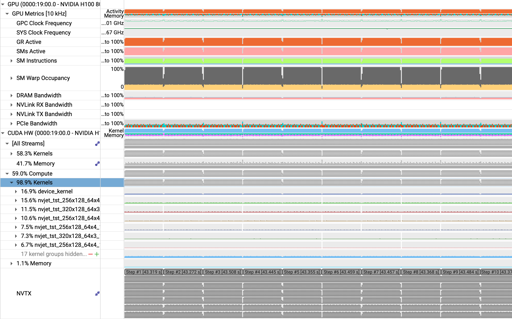
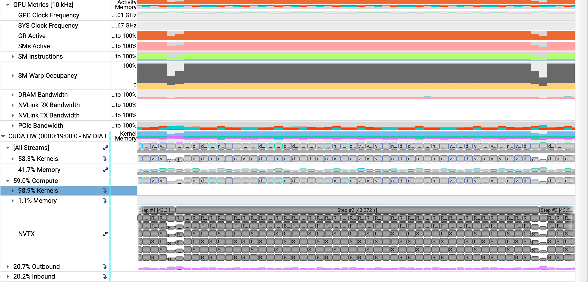
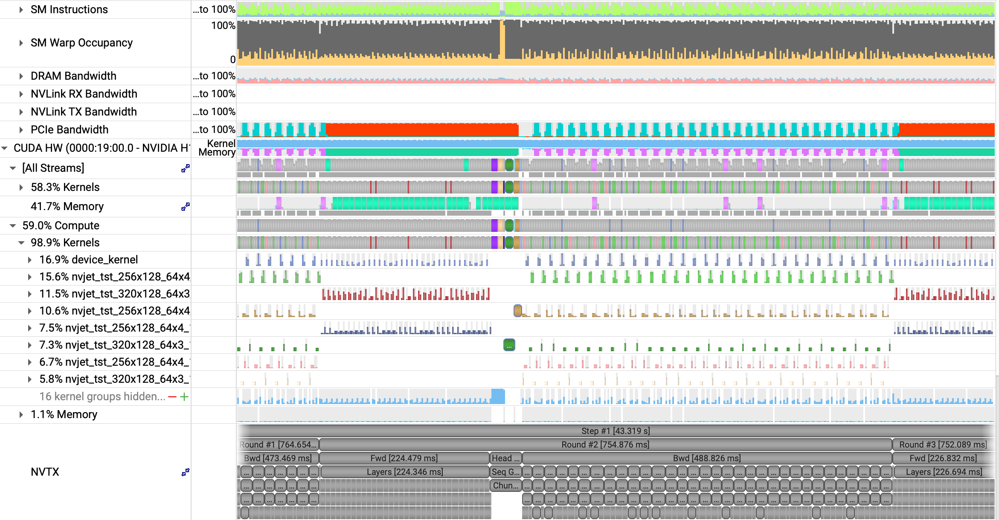
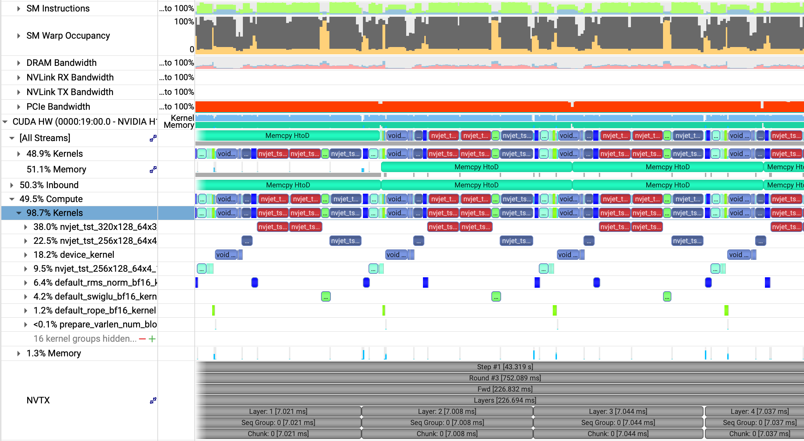
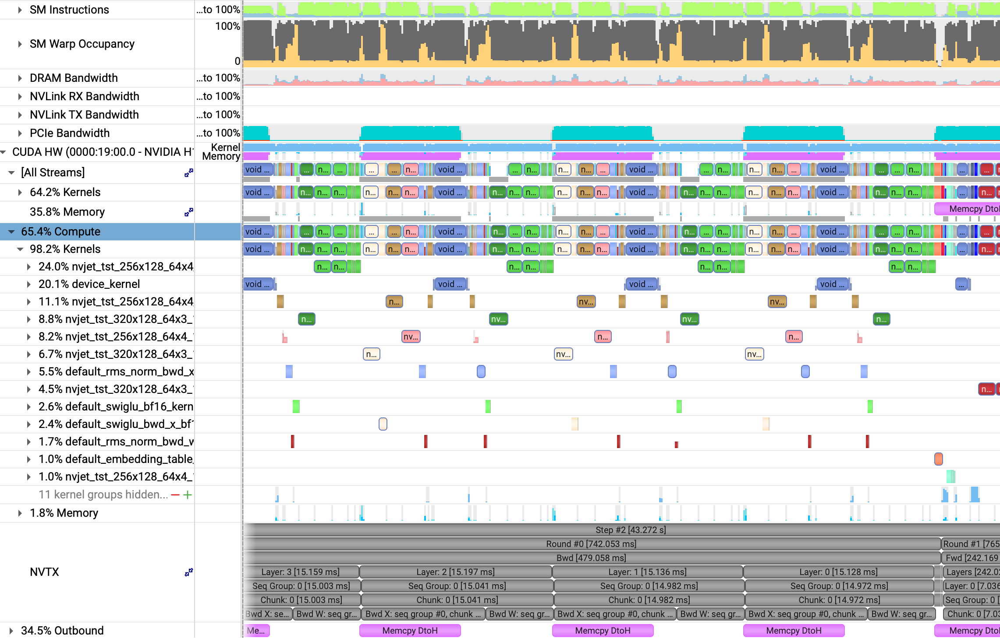
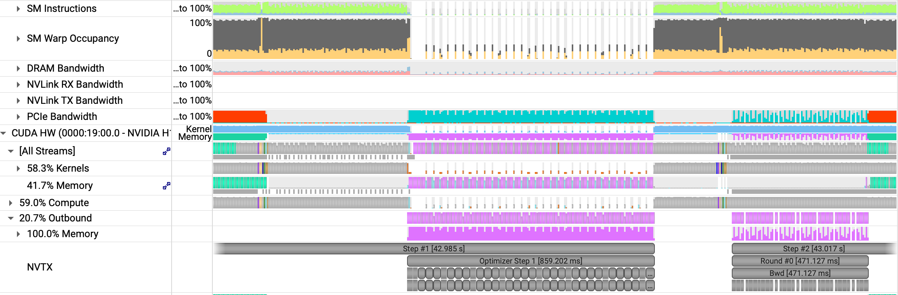

# Example Profiling (Max Throughput Run)

## Training of Llama3 8B with 8k sequence length on H100. 
### Used 80GB of host memory and 78GB of device memory.

- Chunk size: 16384
- Chunks per round: 1
- Seqs per round: 2
- Rounds per step: 56
- Seqs per step: 112
- Global batch size: 917k tokens

The lime green section at the top-ish of each image (corresponding to "SM Instructions") represents the "Tensor Active" ratio (fraction of cycles where a tensor pipe was working). This run achieves 75% tensor active utilization, but the clock rate is throttled as the H100 is power-bound. The "GPC clock" at the top of the first image shows the clock rate (averages 1464 Mhz vs. 1755 Mhz of boost clock).

---

## Training Overview

A few words about the training overview image.

---

## Step Overview

A few words about the step overview image.

---

## Round Overview

A few words about the round overview image.

---

## Forward Layers

A few words about the forward layers image.

---

## Backward Layers

A few words about the backward layers image.

---

## Step Overhead

A few words about the step overhead image.

