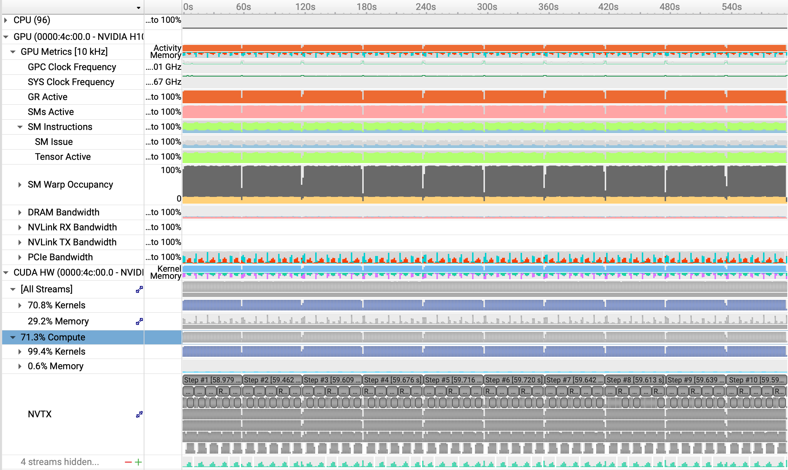
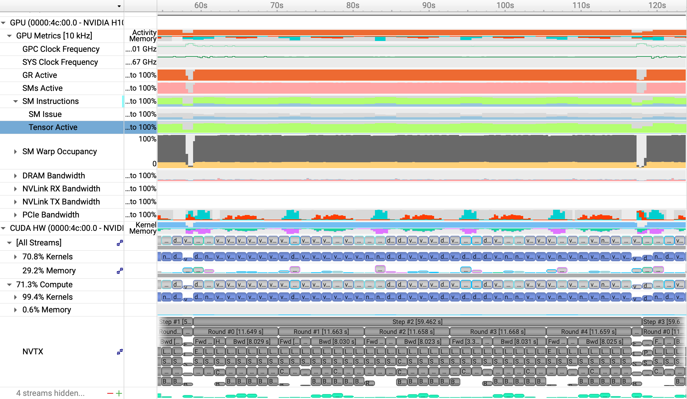
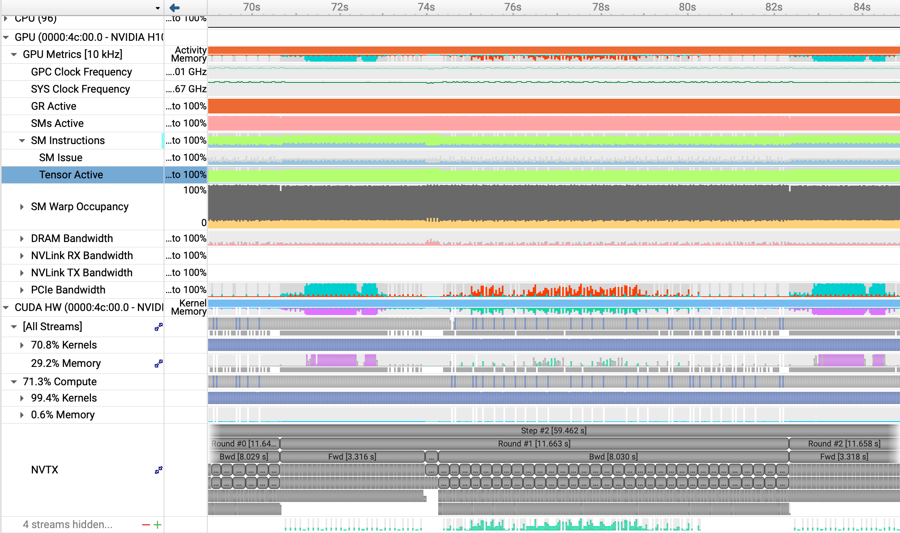
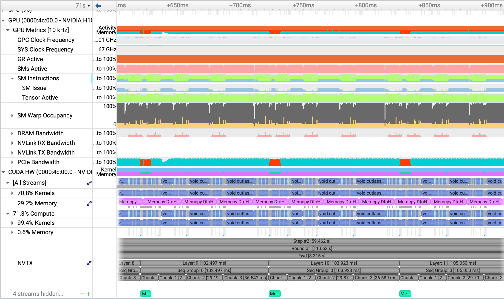
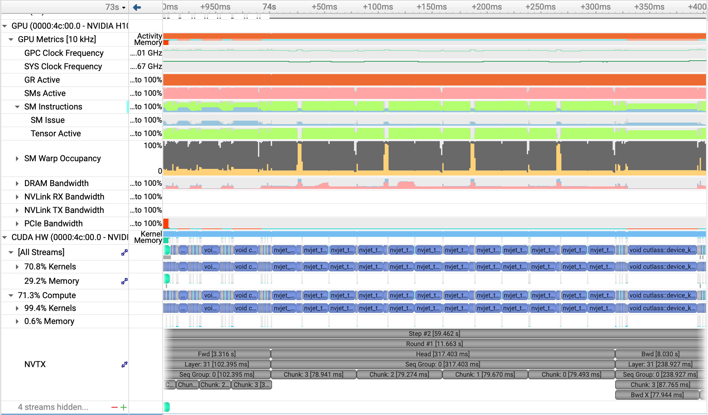
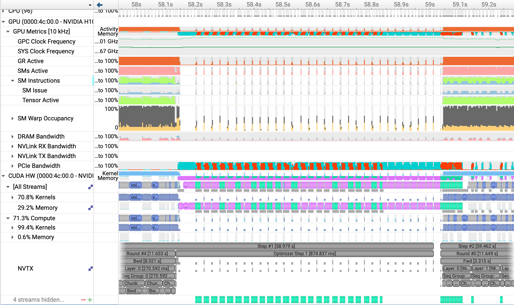
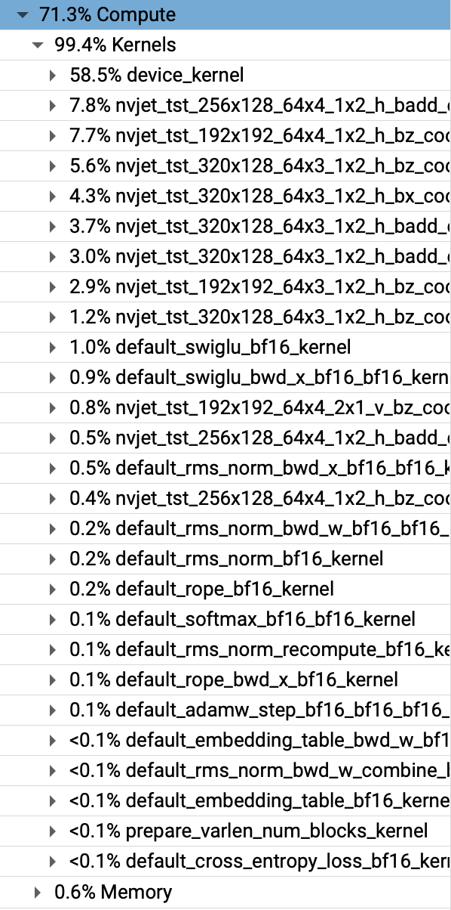

# Example Profiling (Low I/O Pressure -- High Memory + Long Seq)

## Training of Llama3 8B with 64k sequence length on H100. 

To reproduce:

```shell
cd bench
./do_transformer_profile.sh 144 78 65536 8
```

This will create an nsys report: `bench/profiling/host_144_dev_78_seq_65536_model_8.nsys-rep` that can be loading in the Nsight Systems GUI.

### Auto-configuration details

- Chunk size: 16384
- Chunks per round: 4
- Seqs per round: 1
- Rounds per step: 5
- Seqs per step: 5
- Global batch size: 5 seqs/320k tokens

- Device Memory Partitioning (model has 32 blocks)
    - Param Blocks: 9
    - Grad Blocks: 8
    - Total (chunk, layer) full activation slots: 35

- Host Activations ($32 * 4 - 35 = 93$ total):
    - Fully Saved: 73
    - Only Inp + Context + Attn: 20
    - Only Inp + Context: 0


The lime green section at the top-ish of each image (corresponding to "SM Instructions") represents the "Tensor Active" ratio (fraction of cycles where a tensor pipe was working). This run achieves ~80% tensor active utilization, but the clock rate is throttled (as the H100 is power-bound) so we see HFU < .8, in this case HFU = 60%. The "GPC clock" at the top of the first image shows the clock rate (averages 1460 Mhz vs. 1755 Mhz of boost clock).

---

## Training Overview



A few words about the training overview image.

---

## Step Overview



A few words about the step overview image.

---

## Round Overview



A few words about the round overview image.

---

## Forward Layers



A few words about the forward layers image.

---

## Head



A few words about the head image.

---

## Backward Layers


A few words about the backward layers image.

---

## Step Overhead



A few words about the step overhead image.

-----

Full Compute Breakdown (all invoked kernels with perecetage of cycles)



A few words about the compute breakdown image.