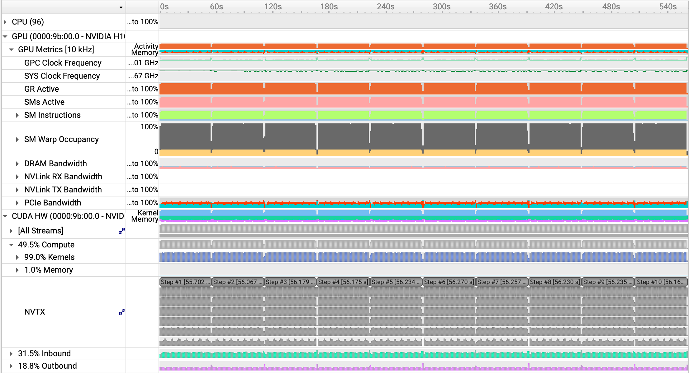
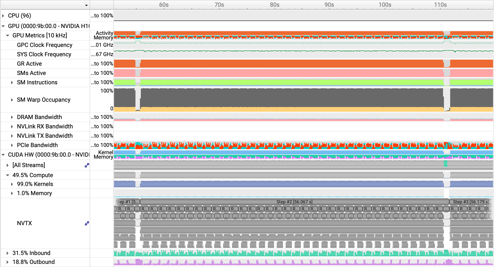
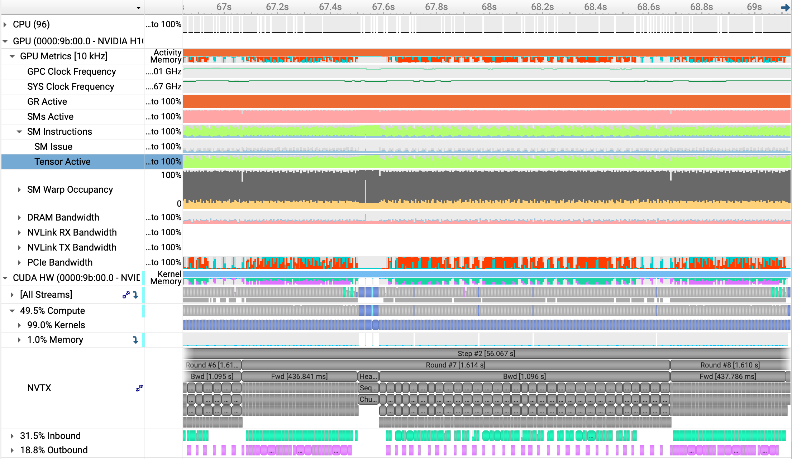
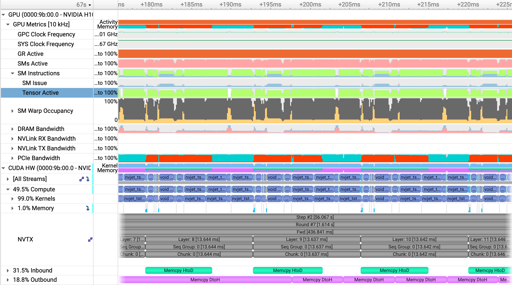
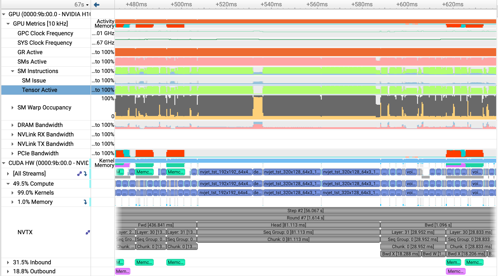
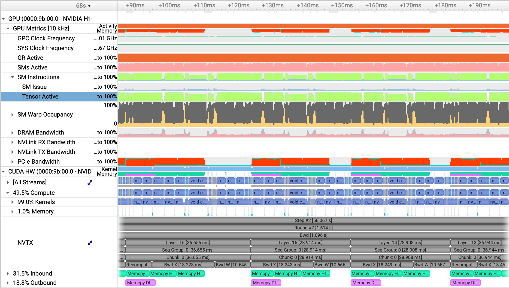
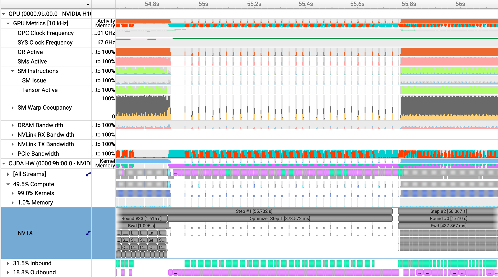
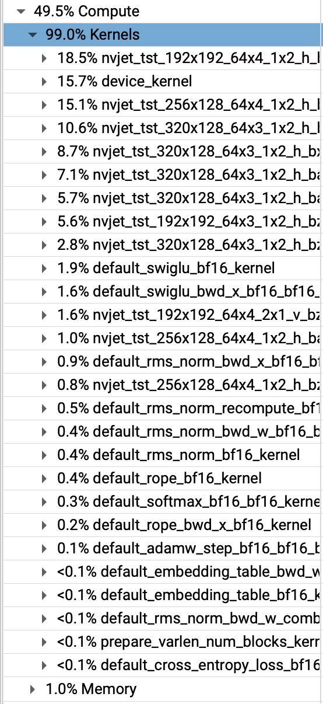

# Example Profiling (High I/O Pressure -- Fast Compute + Small/Medium Memory + Short/Medium Seq)

## Training of Llama3 8B with 8k sequence length on H100. 

To reproduce:

```shell
cd bench
./do_transformer_profile.sh 70 30 8192 8
```

This will create an nsys report: `bench/profiling/host_70_dev_30_seq_8192_model_8.nsys-rep` that can be loading in the Nsight Systems GUI.

### Auto-configuration details

- Chunk size: 16384
- Chunks per round: 1
- Seqs per round: 2
- Rounds per step: 34
- Seqs per step: 68
- Global batch size: 68 seqs/544k tokens

- Device Memory Partitioning (model has 32 blocks)
    - Param Blocks: 5
    - Grad Blocks: 4
    - Total (chunk, layer) full activation slots: 5

- Host Activations ($32 * 1 - 5 = 27$ total):
    - Fully Saved: 6
    - Only Inp + Context + Attn: 21
    - Only Inp + Context: 0

---

## Training Overview



A few words about the training overview image.

---

## Step Overview



A few words about the step overview image.

---

## Round Overview



A few words about the round overview image.

---

## Forward Layers



A few words about the forward layers image.

---

## Head



A few words about the head image.

---

## Backward Layers



A few words about the backward layers image.

---

## Step Overhead



A few words about the step overhead image.

-----

Full Compute Breakdown (all invoked kernels with perecetage of cycles)



A few words about the compute breakdown image.